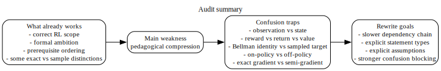

# Audit of the Original Document

## Executive verdict

The original document demonstrates **strong formal ambition and broad topical coverage**. It is plainly written by someone trying to be mathematically explicit rather than slogan-based. It covers the correct backbone of modern reinforcement learning: interaction, return, state and Markov structure, value functions, Bellman equations, dynamic programming, Monte Carlo, temporal-difference learning, SARSA, Q-learning, function approximation, DQN, policy gradients, baselines, actor-critic, PPO, SAC, reward shaping, and evaluation.

That is a strong foundation.

The main weakness is not lack of content. The weakness is **pedagogical compression**. Too many important ideas are placed adjacent to one another without enough hierarchy about which statements are definitions, which are assumptions, which are exact equalities, which are approximations, and which are merely common engineering practice.

My overall judgment is:

- **Fundamental mastery:** high
- **Formal correctness at the chapter-outline level:** high
- **Local derivational clarity:** medium to high
- **Comprehension support for a first serious learner:** medium
- **Ambiguity control:** uneven

## What the original does well

### 1. It begins from definitions instead of folklore

The document starts with the agent-environment loop, explicit random variables, and the reward-index shift $R_{t+1}$. That is the right place to start. Many weaker notes jump straight into algorithms before fixing what is random, what is conditioned on, and what the optimization target actually is.

### 2. It distinguishes exact identities from approximations more often than most lecture notes

The source repeatedly says when something is an exact identity and when a sample is replacing a conditional expectation. That is excellent. In reinforcement learning, confusion often starts exactly where a Bellman expectation is silently replaced by a one-step sample. The source usually flags that transition.

### 3. It includes the right mathematical dependencies

The source does not treat Bellman equations as magic. It lays groundwork with expectation, conditional expectation, return convergence, and trajectory factorization before using those ideas in value functions and policy gradients. That ordering is fundamentally correct.

### 4. It covers both value-based and policy-based RL in one arc

The document is ambitious in a good way. It does not stop at tabular Bellman equations. It connects them to DQN, actor-critic, PPO, and SAC. That makes the notes much more useful as a bridge from foundations to modern practice.

### 5. It tries to formalize topics that are often hand-waved

Reward shaping, evaluation methodology, and representation counts are often discussed sloppily. The original attempts to state them precisely. That is a real strength.

## Where the original is not yet good enough

### 1. The chapter boundaries are too wide

Several section titles cover too many objects at once. For example, one chapter combines value functions, Bellman equations, policy improvement, and generalized policy iteration. Those topics are related, but they are not the same thing.

This matters because a learner needs to know the exact dependency chain:

1. define $V^\pi$, $Q^\pi$, and $A^\pi$
2. derive Bellman expectation equations
3. define Bellman operators
4. prove contraction and uniqueness
5. define optimality equations
6. prove policy improvement
7. interpret policy iteration and generalized policy iteration

If these are packed too tightly, the student can recite formulas without understanding what each formula licenses.

### 2. Definitions, theorems, and engineering recipes are mixed too freely

A formal definition and an algorithm update do not play the same role.

For example:

- “$V^\pi$ is defined as ...” is a definition.
- “$T^\pi$ is a contraction” is a theorem.
- “TD uses the target $R_{t+1} + \gamma V(S_{t+1})$” is a stochastic approximation recipe derived from the theorem-backed Bellman equation.
- “DQN uses replay and frozen targets” is an engineering construction motivated by instability.

The original usually says correct things, but it does not always help the reader classify the kind of statement being made.

### 3. Some notation enters faster than comprehension can keep up

A learner can follow a derivation only if each conditioning variable and each index limit is mentally trackable. In the source, symbol density is sometimes high enough that a reader can lose the thread even when no line is formally wrong.

Typical friction points:

- the transition from history $H_t$ to state $S_t$
- the difference between a representation and a Markov state
- the difference between $Q^\pi$ and $Q^*$
- when a next action is sampled from a policy versus replaced by a maximization
- when a target is treated as fixed during differentiation and when it is not

### 4. “Optional illustration” blocks interrupt formal flow

The source tries to separate optional examples, which is good in principle. But because the optional material is embedded immediately after dense derivations, the flow can still feel fragmented.

A stronger structure is:

- formal statement
- derivation
- what the derivation proves
- boundary conditions
- only then an optional example

That ordering reduces cognitive switching cost.

### 5. The document still leaves several ambiguity traps for students

These are not necessarily errors in the text. They are places where a reader can misunderstand the text unless the note blocks the misunderstanding explicitly.

The most important traps are:

#### Trap A: observation versus state

An observation $O_t$ is whatever the environment reveals.  
A state $S_t$ is whatever summary the agent conditions on.  
A Markov state is a state summary for which the future depends on the past only through $S_t$ and $A_t$.

Those are three different objects. If they are not kept separate, partial observability gets hidden inside notation.

#### Trap B: reward versus return versus value

- reward is one step
- return is the discounted sum from a time onward
- value is the expectation of return under a policy, conditional on state or state-action

Many students think “reward” and “value” differ only in time scale informally. They do not. They are different random quantities.

#### Trap C: Bellman equation versus sampled target

A Bellman equation is an identity about expectations under the true transition law and policy.  
A Monte Carlo or TD target is a random estimator used to learn from samples.  
Confusing the two is one of the most damaging beginner errors.

#### Trap D: on-policy versus off-policy

The decisive check is not “which policy is currently being run in code” in some loose sense.  
The decisive check is:

- which policy generated the data?
- which policy appears inside the target being estimated or improved?

That distinction needs to be stated more bluntly than the source usually does.

#### Trap E: exact gradient versus semi-gradient

In function approximation, especially TD and actor-critic, a learner must know whether differentiation is being taken through the full target or only through the current prediction term. If that point is not explicit, the reader will think every update shown is the exact gradient of a stated loss, which is false.

## Specific clarity improvements the rewrite enforces

### 1. Every chapter begins by stating what problem it solves

That gives the learner a target before the derivation starts.

### 2. Every derivation names the operation being used

Examples:

- condition on the next state and reward
- apply the law of total expectation
- separate the $k=0$ term
- change the index from $k$ to $j=k-1$
- use policy normalization
- freeze the target parameters and differentiate only with respect to the online parameters

### 3. Every chapter distinguishes four categories of statements

- **definition**
- **exact identity or theorem**
- **sampling-based approximation**
- **engineering convention**

This is the most important editorial upgrade.

### 4. Boundary conditions are made explicit

Examples:

- $0 \le \gamma < 1$ in continuing tasks
- $\gamma = 1$ only when the horizon is finite or return is still well-defined
- finite sums require finite spaces unless one switches to integrals
- terminal transitions zero out the future term
- unique-greedy-action formulas change under ties, though lower bounds may survive

### 5. Representation is treated as a first-class concept

A state encoding is not just a data format. It determines whether the Markov property is even available to the learner. The rewrite makes that explicit.

## Summary rating table

| Dimension | Rating | Reason |
| --- | --- | --- |
| Scope | Excellent | It covers the right RL backbone from foundations to modern methods. |
| Mathematical intent | Strong | It tries to justify rather than merely state formulas. |
| Symbol discipline | Good but uneven | Most symbols are defined, but density sometimes outruns comprehension. |
| Pedagogical ordering | Moderate | Correct dependencies exist, but key ideas are packed too tightly. |
| Ambiguity control | Moderate | Several classic misunderstanding points remain insufficiently blocked. |
| Suitability as a first complete reading | Moderate to strong | Good for a serious student, but not yet optimized for zero-ambiguity learning. |

## Bottom line

The original is a **serious and worthwhile first draft**, not a weak note set. Its problem is not lack of intelligence or correctness. Its problem is that it asks too much of the reader’s internal bookkeeping.

This rewrite keeps the rigor, but restructures the material so that:

- each symbol arrives in a controlled order,
- each conclusion states what it proves,
- each approximation is visibly marked,
- and the learner can see the dependency chain rather than reconstructing it mentally.
