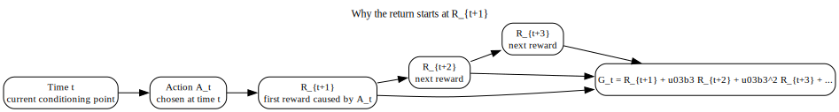
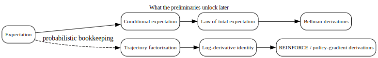

# Chapter 2 — Mathematical Preliminaries

## What this chapter locks in

This chapter fixes the probability facts used later in Bellman equations and policy gradients.

The goal is not to pile up detached formulas.  
The goal is to make later derivations readable.

By the end of this chapter, you should know:

- what expectation and conditional expectation actually check,
- how the law of total expectation is used inside Bellman derivations,
- why discounted return is well-defined under the standard assumptions,
- how trajectory probabilities factorize in a finite-horizon Markov model,
- and how the log-derivative identity converts differentiation of a probability law into an expectation.

---

## 1. Standing assumptions

These are the default assumptions for this chapter unless a subsection says otherwise.

### Finite or countable sums when sums are written

If a formula is written as a sum over states, actions, rewards, or trajectories, then the chapter is assuming a finite or countable space for which the sum is meaningful.

If the space is continuous, the same logic usually survives, but sums must be replaced by integrals and probabilities by densities when appropriate.

### Bounded rewards

Assume there is a finite constant $R_{\max} \ge 0$ such that

$$
|R_t| \le R_{\max}
$$

almost surely for every $t$.

This is what keeps discounted returns under control in continuing tasks.

### Discounting in continuing tasks

For continuing tasks, assume

$$
0 \le \gamma < 1.
$$

If $\gamma = 1$ in a genuinely continuing problem, an infinite-horizon return can fail to converge unless extra structure is imposed.

### Finite-horizon assumptions for policy-gradient derivations

When the chapter writes expectations over full trajectories and differentiates them term by term, assume:

- a finite horizon $T$,
- a differentiable policy $\pi_\theta$,
- and enough regularity to justify interchanging derivative and summation.

---

## 2. Expectation

Let $X$ be a discrete random variable on a finite or countable set $\mathcal{X}$.  
Then

$$
\mathbb{E}[X] = \sum_{x \in \mathcal{X}} x \, P(X=x),
$$

provided the sum is well-defined.

### What this checks

Expectation is a probability-weighted average of possible values.

The possible values of $X$ are the outcomes.  
The probabilities are the weights attached to those outcomes.

### Why this matters later

A value function is an expectation of return.  
So if expectation itself is slippery, then every value definition later will feel slippery too.

---

## 3. Conditional expectation

If $X$ and $Y$ are random variables, then the conditional expectation of $X$ given $Y=y$ is

$$
\mathbb{E}[X \mid Y=y].
$$

In a discrete setting, this can be written as

$$
\mathbb{E}[X \mid Y=y] = \sum_x x \, P(X=x \mid Y=y).
$$

### What conditioning changes

Conditioning does **not** change the possible values of $X$.  
It changes the probability weights assigned to those values after the event $Y=y$ is known.

### Why this matters in RL

Bellman equations are conditional expectation statements.

For example, $V^\pi(s)$ is not an unconditional average return over the whole process.  
It is the expected return **conditional on the current state being $s$**.

That conditioning event is the whole point.

---

## 4. Law of total expectation

The law of total expectation says that if you split according to the values of another random variable $Y$, then

$$
\mathbb{E}[X] = \sum_y P(Y=y)\,\mathbb{E}[X \mid Y=y].
$$

### What this means procedurally

To compute an overall expectation of $X$, you may:

1. split the world into cases indexed by $Y$,
2. compute the expected value of $X$ inside each case,
3. then average those case-specific expectations using the probabilities of the cases.

### Why this matters in Bellman derivations

Bellman equations repeatedly use the same move:

- start with an expectation conditional on the current state or state–action pair,
- split according to the next action or next transition outcome,
- then average over those possibilities.

Once you understand this move, Bellman equations stop looking like magic.

---

## 5. Discounted return

Define the return from time $t$ by

$$
G_t = \sum_{k=0}^{\infty} \gamma^k R_{t+k+1}.
$$

### Why the first reward term is $R_{t+1}$

At time $t$, action $A_t$ is chosen.  
The first reward caused by that action is observed after the transition, so the first term is $R_{t+1}$, not $R_t$.

### Why the reward index is $t+k+1$

When $k=0$, the reward is one step after time $t$.  
When $k=1$, it is two steps after time $t$.  
So the $k$-th term must be indexed $t+k+1$.

---

## 6. Why discounted return is well-defined

Under bounded rewards and $0 \le \gamma < 1$,

$$
|G_t|
\le \sum_{k=0}^{\infty} \gamma^k |R_{t+k+1}|
\le \sum_{k=0}^{\infty} \gamma^k R_{\max}
= \frac{R_{\max}}{1-\gamma}.
$$

### What this proves

The infinite series converges absolutely and is uniformly bounded under the standing assumptions.

### What conclusion this licenses

Once this bound is established, quantities like

$$
V^\pi(s) = \mathbb{E}[G_t \mid S_t=s]
$$

are at least meaningful mathematical objects under those assumptions.

That matters more than it first appears.  
A later Bellman derivation is only respectable if the quantity being manipulated is actually well-defined.

---

## 7. Finite-horizon trajectory distributions

For a finite-horizon episodic problem with horizon $T$, define a trajectory by

$$
\tau = (s_0, a_0, r_1, s_1, a_1, r_2, \ldots, s_{T-1}, a_{T-1}, r_T, s_T).
$$

Let $\rho(s_0)$ be the initial-state distribution.  
If the policy is $\pi$ and the environment law is $P(s',r \mid s,a)$, then

$$
p_\pi(\tau)
=
\rho(s_0)\prod_{t=0}^{T-1}
\pi(a_t \mid s_t)\,
P(s_{t+1}, r_{t+1} \mid s_t, a_t).
$$

### What this factorization checks

At each time index $t$, exactly two stochastic mechanisms are being applied:

- the policy selects $a_t$ given $s_t$,
- the environment produces $(s_{t+1}, r_{t+1})$ given $(s_t, a_t)$.

Multiplying these factors across time gives the trajectory probability.

### Why this matters

Policy-gradient derivations work with expectations over trajectories.  
Those expectations become manageable only after the trajectory law is written as a product of local factors.

---

## 8. Differentiating expectations

Suppose $f(\tau)$ does not depend explicitly on the policy parameter vector $\theta$.  
Then under the finite-horizon assumptions,

$$
\nabla_\theta \sum_\tau p_\theta(\tau) f(\tau)
=
\sum_\tau \nabla_\theta p_\theta(\tau) f(\tau).
$$

This still leaves the hard part: how to differentiate $p_\theta(\tau)$.

---

## 9. The log-derivative identity

The key identity is

$$
\nabla_\theta \log p_\theta(\tau)
=
\frac{1}{p_\theta(\tau)} \nabla_\theta p_\theta(\tau),
$$

which can be rearranged as

$$
\nabla_\theta p_\theta(\tau)
=
p_\theta(\tau)\nabla_\theta \log p_\theta(\tau).
$$

### What this identity changes

It converts a derivative of a probability into:

- the probability itself,
- multiplied by a derivative of a log probability.

That is exactly the shape needed to turn a derivative of an expectation into an expectation of a score term.

### Why this is the gateway to REINFORCE

Without this identity, policy-gradient derivations stay stuck at “differentiate the trajectory probability.”

With this identity, the derivative moves inside the expectation in a usable form.

---

## 10. What this chapter unlocks later

This chapter is not a side note. It is a dependency lock.

- Bellman equations rely on conditional expectation and the law of total expectation.
- Value definitions rely on return being well-defined.
- Policy gradients rely on trajectory factorization and the log-derivative identity.

If these pieces are unstable, later chapters become symbol pushing instead of reasoning.

---

## 11. Common confusions blocked here

### Confusion 1: Expectation is just “the average case” in a vague sense

No.  
Expectation is a precisely weighted sum or integral under a specified probability law.

### Confusion 2: Conditioning adds new outcomes

No.  
Conditioning changes weights, not the underlying possible values.

### Confusion 3: The discounted return formula is automatically valid in any setting

No.  
Its infinite-horizon form needs assumptions.  
Bounded rewards and $0 \le \gamma < 1$ are doing real work.

### Confusion 4: The policy-gradient trick starts with calculus and ends with luck

No.  
It depends on a specific chain of reasoning:

1. write the expectation over trajectories,
2. factorize the trajectory law,
3. differentiate that law,
4. use the log-derivative identity,
5. rewrite the result as an expectation.

---

## 12. Mastery check

You understand this chapter if you can answer all of these cleanly.

1. What does conditioning change in a conditional expectation?
2. What exact move does the law of total expectation license in a Bellman derivation?
3. Under what assumptions is the discounted infinite-horizon return guaranteed to be finite?
4. In the trajectory factorization, what are the two stochastic choices made at each time step?
5. Why does the log-derivative identity matter for policy gradients?

If any answer is still half-verbal and half-handwave, tighten it now.  
This chapter is the toolkit for the next five.
