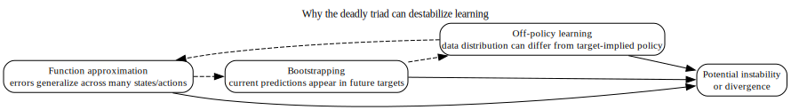
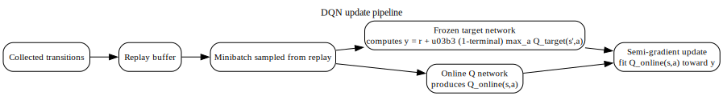

# Chapter 7 — Function Approximation, the Deadly Triad, and DQN

## What this chapter locks in

This chapter explains what changes when value functions are no longer stored in tables.

The most important shift is not “now we use neural networks.”  
The important shift is that the object being learned becomes a parameterized function, so one update can affect many inputs at once.

By the end of this chapter, you should know:

- why tabular methods stop scaling,
- how approximation turns value learning into regression,
- why the deadly triad is a genuine stability risk,
- what the DQN target contains,
- why target networks and replay are introduced,
- and why representation is part of the RL problem itself.

---

## 1. Why tabular methods stop scaling

A tabular method stores a separate value for each state or state–action pair.

That works when the relevant space can be enumerated and revisited often enough.

It fails when the space is:

- too large,
- too sparse,
- high-dimensional,
- or continuous.

So instead of a table, we use a parameterized approximator such as

$$
\widehat V(\cdot; w)
\quad\text{or}\quad
\widehat Q(\cdot,\cdot; w),
$$

with parameter vector $w$.

### What changes conceptually

In a table, each entry can be updated locally.

With function approximation, changing $w$ at one sample typically changes predictions at many other inputs too.

That coupling is the main conceptual shift.

---

## 2. Approximation turns value learning into regression

Suppose you have a target quantity $Y_t$ that you want $\widehat Q(S_t,A_t;w)$ to match.

Then learning can be framed as reducing a prediction error, often through a squared loss of the form

$$
\bigl(Y_t - \widehat Q(S_t,A_t;w)\bigr)^2.
$$

### What is being fitted

The approximator is not being told the true $Q^\pi$ or $Q^*$ directly.

It is being fit to targets constructed from data and possibly from current predictions.

### Why that matters

Once the target itself depends on the current model, optimization is no longer ordinary supervised learning with fixed labels.

That is one major source of instability.

---

## 3. The three pieces of the deadly triad

The deadly triad is the simultaneous presence of:

1. function approximation,
2. bootstrapping,
3. off-policy learning.

These three ingredients matter separately, but the danger arises from their interaction.

---

## 4. Why the triad is dangerous

### Function approximation

An update at one input changes predictions at many other inputs because all those predictions share parameters.

### Bootstrapping

Targets depend on current predictions, so errors can feed into future targets.

### Off-policy learning

The data distribution can differ from the occupancy distribution of the policy implicit in the target.

### Put together

Now combine the three facts:

- shared parameters spread local errors,
- bootstrapped targets can propagate those errors forward,
- off-policy sampling means the parts of the space emphasized by data and by the target need not line up.

That is why instability or divergence becomes possible.

### Important caution

The deadly triad is a **risk structure**, not a statement that every such method must fail.

It tells you where to expect trouble and why stabilizing design choices are needed.

---

## 5. DQN as approximate Q-learning

DQN keeps the Q-learning target structure but replaces the tabular action-value function by a neural approximator.

For a sampled transition

$$
(S_t, A_t, R_{t+1}, S_{t+1}, \zeta_t),
$$

where $\zeta_t \in \{0,1\}$ indicates whether the transition is terminal, define the DQN target as

$$
Y_t^{\mathrm{DQN}}
=
R_{t+1}
+
\gamma (1-\zeta_t)\max_{a'} Q(S_{t+1}, a'; w^-).
$$

Here $w^-$ denotes the frozen target-network parameters.

---

## 6. What each term in the DQN target checks

### Immediate reward term

$R_{t+1}$ is the observed reward from the sampled transition.

### Terminal mask

$(1-\zeta_t)$ checks whether future continuation should be included.

If $\zeta_t = 1$, the sampled transition ends the episode and the continuation term must be zero.

### Greedy continuation term

$\max_{a'}Q(S_{t+1}, a'; w^-)$ is the estimated best continuation value at the next state, evaluated using the target network.

### Discount factor

$\gamma$ scales the continuation term.

### Terminal boundary condition

If $\zeta_t = 1$, then

$$
Y_t^{\mathrm{DQN}} = R_{t+1}.
$$

That boundary condition is important enough to say explicitly.

---

## 7. Why the target network is frozen

The parameter vector $w^-$ is held fixed for a period of time while the online network parameters $w$ are updated.

### What problem this addresses

If the same rapidly changing network is used both:

- to define the target,
- and to fit the prediction to that target,

then the target can move at the same moment the predictor is trying to chase it.

### What freezing changes

Freezing does not make the target fully stationary forever.  
But it slows target drift enough to make learning more stable.

That is why the target network is not decorative.  
It is a stabilization device.

---

## 8. Replay

DQN usually trains on transitions sampled from a replay buffer.

### What replay changes

Replay stores past transitions and reuses them later.

This helps in two main ways:

- it reduces short-range correlation among training samples,
- and it improves sample reuse.

### What replay does **not** change

Replay does not automatically make the method on-policy.  
If the target is still based on a different continuation policy structure than the behavior that generated the data, the method remains off-policy in that sense.

---

## 9. Semi-gradient flavor

In practice, DQN fits the online network prediction to a target built using frozen parameters $w^-$.

That means the target is treated as fixed when differentiating with respect to $w$ for that update.

### Why this matters

You should always ask:

- which quantity is being differentiated through,
- and which quantity is being treated as fixed?

That question becomes even more important in later actor–critic methods.

---

## 10. Representation is part of the problem

A function approximator does not receive raw reality.  
It receives whatever state or observation representation you give it.

If the representation aliases different latent situations together, then the approximator is being asked to fit incompatible targets to the same input.

So representation is not merely an implementation detail.  
It affects whether the value function is even representable in a stable and coherent way.

---

## 11. Common confusions blocked here

### Confusion 1: Function approximation just means “use a bigger value table”

No.  
Shared parameters create coupling across inputs, which changes the learning dynamics fundamentally.

### Confusion 2: The deadly triad means any modern RL method is doomed

No.  
It identifies a risk pattern.  
It does not say divergence is guaranteed.

### Confusion 3: The target network is only for convenience

No.  
Its role is to slow target drift and reduce instability.

### Confusion 4: Replay makes a method on-policy because it reuses experience

No.  
Replay and on-policy/off-policy are different axes.

---

## 12. Mastery check

You understand this chapter if you can answer all of these cleanly.

1. What changes conceptually when a value function becomes parameterized rather than tabular?
2. Why does bootstrapping become more dangerous when function approximation is present?
3. In the deadly triad, what role does off-policy data distribution mismatch play?
4. What exact terms appear in the DQN target, and what does each one mean?
5. Which parameters define the prediction being updated, and which parameters define the target during a DQN step?

If those answers are not solid, slow down here.  
This chapter is the transition from exact tabular logic to modern approximation-based RL.
