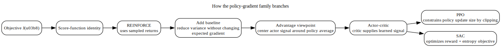
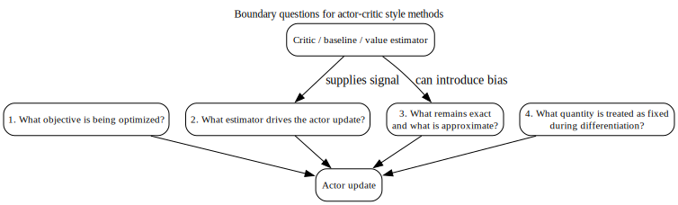

# Chapter 7 — Policy Gradients, REINFORCE, Baselines, Actor–Critic, PPO, and SAC

## What this chapter locks in

This chapter is conceptually dense because several different families of methods live under the broad heading of “policy optimization.”

The main danger is thinking they all differ only by implementation tricks.

They do not.

They differ in:

- what objective is being optimized,
- what estimator is used for the policy update,
- what is treated as exact and what is estimated,
- where variance enters,
- where bias can enter,
- and what role entropy or clipping plays.

This rewrite makes those boundaries explicit.

---

## 1. Why optimize the policy directly?

Value-based methods try to estimate action values and then improve behavior indirectly through greedification or exploration around those values.

Policy-gradient methods instead parameterize the policy itself:

$$
\pi_\theta(a \mid s).
$$

The goal is to adjust $\theta$ so that the expected return objective increases.

A common finite-horizon objective is

$$
J(\theta) = \mathbb{E}_{\tau \sim p_\theta}[G_0(\tau)].
$$

### What changes conceptually

The policy is no longer derived as a side effect of a value function.  
It is the primary optimization object.

---

## 2. The score-function route to REINFORCE

The derivation starts by writing the objective as an expectation over trajectories.

Then differentiate that expectation with respect to $\theta$.

The derivative first lands on the trajectory probability $p_\theta(\tau)$.  
Use the log-derivative identity to rewrite that derivative in the form

$$
p_\theta(\tau)\nabla_\theta \log p_\theta(\tau).
$$

Because the trajectory law factorizes over time and only the policy factors depend on $\theta$, the resulting score term becomes a sum of policy-log-gradient terms across time.

### What this yields conceptually

The gradient of expected return can be written as an expectation of a trajectory-dependent weight multiplied by policy score terms.

That is the heart of REINFORCE.

---

## 3. REINFORCE

A finite-horizon REINFORCE-style gradient contribution has the form

$$
\sum_{t=0}^{T-1}
\gamma^t
\nabla_\theta \log \pi_\theta(A_t \mid S_t)\, G_t
$$

inside an expectation.

### What this means

At time $t$, actions that were followed by high return are reinforced in the direction that increases their log probability.

### What makes REINFORCE appealing

It gives a conceptually clean, unbiased policy-gradient estimator under the usual assumptions.

### What makes REINFORCE difficult

The estimator can have high variance because the sampled return can fluctuate a lot.

So the next question is not “is REINFORCE correct?”  
The next question is “how do we reduce variance without changing the expected gradient?”

---

## 4. Baselines

A baseline is a term subtracted from the return-like weight in the policy update.

A standard safe choice is a state-dependent baseline $b(S_t)$.

Then the update weight becomes $G_t - b(S_t)$.

### Why this does not change the expected gradient

Condition on the current state $S_t$.

The baseline term is now a factor that does not depend on which action was sampled.

But the action-dependent part of the score has conditional expectation zero under the policy.

That is the key zero-mean argument.

### What this proves

Subtracting a state-only baseline leaves the expected gradient unchanged.

### What it improves

It can reduce variance.

### Boundary condition

The baseline must not depend on the sampled action in a way that breaks the zero-mean argument.

---

## 5. Advantage viewpoint

If the baseline is chosen as the state value $V^\pi(S_t)$, then the weight

$$
G_t - V^\pi(S_t)
$$

behaves like an advantage-style quantity.

More fundamentally, the exact policy-gradient contribution at time $t$ is associated with the true advantage $A^\pi(S_t,A_t)$.

### What this says conceptually

The actor should not simply ask whether the total return was high.  
It should ask whether the sampled action was better or worse than the state’s typical continuation under the current policy.

That comparison is what advantage captures.

---

## 6. Actor–critic

Actor–critic methods combine:

- an actor, which updates the policy,
- and a critic, which estimates value information used to build lower-variance policy-update weights.

Typically, the critic provides an estimate $\widehat A_t$ or related quantity for the actor update.

### What the actor needs

The actor needs a weight telling it whether the sampled action was better or worse than expected.

### What the critic provides

The critic estimates that weight by learning value information.

### Where bias can enter

If the critic’s estimate is imperfect, then the actor’s update direction may be biased relative to the exact policy gradient.

That is not a minor footnote.  
It is one of the central tradeoffs of actor–critic methods:

- lower variance,
- but possible bias from approximation.

---

## 7. PPO

Proximal Policy Optimization introduces a controlled policy update rather than letting the policy ratio move arbitrarily far in one step.

A key PPO ingredient is the probability ratio between new and old policy probabilities for the sampled action.

### What PPO is trying to prevent

If one update moves the policy too far, then the data collected under the old policy may become a poor basis for the new update and learning can become unstable.

### What clipping does conceptually

The clipped objective limits how much benefit the optimization can claim from large changes in the policy ratio.

This does not make PPO “exact.”  
It makes the update more conservative.

### What to keep straight

PPO is not just “policy gradient with a clip because it works better.”

It is a method designed to constrain update size so that policy improvement uses data in a more locally trustworthy way.

---

## 8. Entropy and stochasticity

Many actor-style methods include an entropy term in the objective or a temperature-style control.

### What entropy does

Entropy rewards policies for remaining distributed rather than collapsing too early onto one action.

### Why that matters

A too-early collapse can destroy exploration and make optimization brittle.

Entropy is not automatically good in unlimited quantity.  
It is a control on the exploration–exploitation balance.

---

## 9. Soft Actor–Critic (SAC)

SAC optimizes a maximum-entropy style objective, balancing expected return with policy entropy.

### What changes conceptually relative to plain policy gradient

The objective is no longer just expected return.  
It explicitly includes a preference for stochastic policies through an entropy term.

### Why that matters

The learned policy is not simply trying to maximize reward.  
It is trying to maximize reward while also maintaining entropy according to the chosen temperature or weighting.

So SAC is not just “another actor–critic.”  
It changes the optimization target itself.

---

## 10. The key boundary questions for this whole chapter

Whenever you read a policy-optimization method, ask these questions in order.

### First question: what objective is being optimized?

Is it plain expected return, clipped surrogate return, or a maximum-entropy objective?

### Second question: what estimator drives the actor update?

Is it based on full returns, a baseline-adjusted return, a critic-estimated advantage, or something else?

### Third question: what remains exact and what is approximate?

Is the update unbiased in principle, or is bias introduced by critic approximation, clipping, truncation, or a frozen target?

### Fourth question: what quantity is treated as fixed during differentiation?

This matters whenever targets are built using learned components.

These questions keep the chapter from collapsing into a bag of names.

---

## 11. Common confusions blocked here

### Confusion 1: REINFORCE, actor–critic, PPO, and SAC are all the same algorithm with minor tweaks

No.  
They differ in objective, estimator, bias–variance profile, and stabilization mechanism.

### Confusion 2: A baseline changes what gradient is being estimated

A state-only baseline does not change the expected gradient.  
Its role is variance reduction.

### Confusion 3: Actor–critic gives the exact policy gradient but faster

Not necessarily.  
Approximate critics can bias the actor update.

### Confusion 4: PPO clipping proves safe monotonic improvement automatically

No.  
It is a heuristic constraint that aims to keep updates more local and stable.

### Confusion 5: SAC is just PPO with entropy

No.  
SAC is built around a different objective structure.

---

## 12. Mastery check

You understand this chapter if you can answer all of these cleanly.

1. Why do policy-gradient methods optimize a different primary object than value-based methods?
2. What exact conversion does the log-derivative identity enable in the REINFORCE derivation?
3. Why can a state-only baseline be subtracted without changing the expected gradient?
4. What does the critic provide in actor–critic, and where can bias enter?
5. What problem is PPO clipping trying to control?
6. In SAC, what is different about the objective itself?

If you cannot answer those cleanly, do not move on yet.  
This chapter is where modern policy optimization either becomes coherent or becomes a pile of method names.
