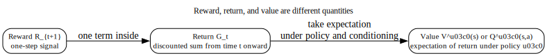
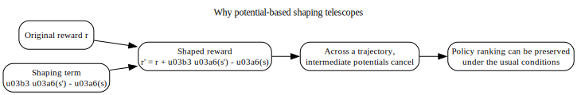
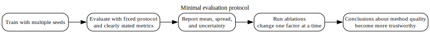

# Chapter 9 — Reward Design, Representation, Evaluation, and Roadmap

## What this chapter locks in

This chapter covers topics that are often treated casually even though they shape whether an RL result means anything.

The goal here is not to tack on “practical considerations.”  
The goal is to make four facts explicit:

- reward, return, and value are different objects,
- reward shaping has exact conditions under which it preserves optimal behavior,
- representation can break the Markov property through aliasing,
- and evaluation is only credible when the reporting protocol is explicit and controlled.

---

## 1. Reward, return, and value are different

### Immediate reward

The immediate reward is the one-step signal observed after action $A_t$:

$$
R_{t+1}.
$$

### Return

The return from time $t$ aggregates future rewards:

$$
G_t = \sum_{k=0}^{\infty} \gamma^k R_{t+k+1}
$$

in the continuing discounted case.

### Value

A value function is an expectation of return under specified conditioning and policy assumptions.

For example,

$$
Q^\pi(s,a) = \mathbb{E}_\pi[G_t \mid S_t=s, A_t=a].
$$

### Why this distinction matters

A learner is usually not trying to maximize the immediate reward in isolation.

Only when $\gamma = 0$ does the problem collapse to one-step reward maximization.

In general, reinforcement learning is about long-run consequences.

---

## 2. Potential-based reward shaping

Suppose the original reward is $r_t$, and choose a potential function

$$
\Phi : \mathcal{S} \to \mathbb{R}.
$$

Define the shaped reward by

$$
r_t' = r_t + \gamma \Phi(S_{t+1}) - \Phi(S_t).
$$

### What this adds

The shaping term rewards movement toward states with higher potential and penalizes movement away from them, in a discount-consistent way.

### Why the telescoping effect matters

When you sum the shaping terms across a trajectory, the intermediate potentials cancel in a telescoping pattern.

That means the shaped return differs from the original return mainly by boundary terms, not by arbitrary path distortions.

### What conclusion this supports

Under the standard conditions, potential-based shaping preserves which policies are optimal.

This is the precise sense in which shaping can alter learning dynamics without changing the optimal-control solution.

---

## 3. Why reward design is not cosmetic

Changing the reward can change which behaviors are preferred.

A living reward, step penalty, or sparse terminal bonus changes the tradeoff between:

- speed,
- risk,
- path length,
- and delayed payoff.

### What to remember

A reward function is not just a scoring scheme layered on top of the same objective.  
It **is** the objective signal that defines what the learner is optimizing.

So a reward change is a problem-definition change unless it belongs to a shaping family with a proven invariance property.

---

## 4. Representation and non-Markov aliasing

A representation may be compact while still failing to preserve the information needed for Markov prediction.

### What aliasing means

Two distinct latent situations may map to the same representation even though they imply different future transition or reward laws under the same action.

If that happens, the representation is not Markov.

### Why this matters

Then a single input representation is being asked to stand for multiple different predictive situations.

That can distort value learning, policy learning, or both.

### What this blocks

Do not confuse compactness with sufficiency.  
A small representation is not automatically a good state.

---

## 5. Evaluation methodology

Suppose an algorithm is run under multiple independent random seeds, producing evaluation returns

$$
X_1, X_2, \ldots, X_N.
$$

A sample mean is then

$$
\widehat\mu_N = \frac{1}{N}\sum_{i=1}^N X_i.
$$

### Why multiple seeds matter

RL outcomes can vary because of:

- random initialization,
- stochastic environments,
- exploration randomness,
- and training instability.

A single run is not enough evidence.

### Minimum information a useful evaluation report should include

A credible report should specify at least:

1. the environment and task definition,
2. the reward specification,
3. the observation or state representation,
4. the training budget,
5. the evaluation policy,
6. the number of seeds,
7. the summary statistic across seeds,
8. measures of spread or uncertainty,
9. and ablations that isolate major components.

---

## 6. What an ablation is

An ablation is a controlled comparison in which one component is removed or changed while the rest of the protocol is kept fixed.

### Why this definition matters

If many ingredients change at once, then the comparison no longer isolates the role of the component you claim to be testing.

So “we turned off replay and also changed the network and learning rate” is not a clean ablation.

---

## 7. Boundary conditions in route or living-reward analyses

In finite-horizon or deterministic route comparisons, changing a living reward can shift which path is optimal.

### What is being compared

You are comparing total returns of different route structures, not merely their one-step rewards.

### Why the threshold can move

A path with more steps accumulates the living reward more times.  
So when that reward changes, the balance between a shorter and longer route can change.

### What this teaches

Reward design can alter the preferred policy region in a mathematically direct way.

That is not philosophy.  
It is a consequence of the return definition.

---

## 8. Where the road continues

Once the material in this sequence is stable, the natural next topics include:

- eligibility traces and multi-step methods,
- partial observability and belief-state ideas,
- deeper treatment of offline RL,
- model-based RL,
- and representation learning for control.

But the purpose of this chapter is not to chase new topics immediately.  
It is to stabilize the conceptual ground so that later extensions do not rest on fuzzy foundations.

---

## 9. Common confusions blocked here

### Confusion 1: Reward and value are the same thing

No.  
Reward is one-step.  
Return aggregates rewards over time.  
Value is an expectation of return.

### Confusion 2: Reward shaping is always harmless

No.  
Only specific shaping constructions, such as potential-based shaping under the right assumptions, come with preservation guarantees.

### Confusion 3: A compact representation is automatically a good state

No.  
A compact representation can still alias distinct predictive situations.

### Confusion 4: One strong run is enough to evaluate an RL method

No.  
RL results can vary materially across seeds and protocols.

### Confusion 5: Any changed-component comparison is an ablation

No.  
A true ablation isolates one component while holding the rest fixed.

---

## 10. Mastery check

You understand this chapter if you can answer all of these cleanly.

1. What is the exact difference between reward, return, and value?
2. Why can potential-based shaping preserve optimal policies even though it changes one-step rewards?
3. What does representation aliasing mean, and why does it threaten the Markov property?
4. Why are multiple random seeds necessary for credible evaluation?
5. What makes a comparison a clean ablation rather than a loose variant study?

This chapter is where the course stops being only about algorithms and becomes about whether your formulation and evidence actually mean what you think they mean.
