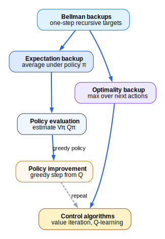
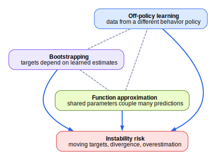
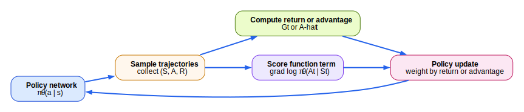

# Reinforcement Learning Foundations

This chapter presents a self-contained treatment of reinforcement learning at the level of explicit definitions, derivations, and justifications. The objective is to state the underlying optimization problems precisely, derive the central equations step by step, and separate formal arguments from optional illustrations. When a formula is written as a finite sum, the text is assuming finite state and action spaces. When a continuous space is intended, the corresponding sums are to be replaced by integrals and densities under the same definitions.

## 1. Formal Problem Setup and Agent-Environment Interaction

### 1.1 Problem statement

Let time be discrete, with index set

$$
t \in \{0,1,2,\ldots\}.
$$

At each time step, an agent interacts with an environment. The environment reveals information, the agent chooses an action, and the environment returns a reward and the information needed for the next step. The problem is to specify a rule for choosing actions so that a long-run performance objective is maximized.

The primitive random variables are:

- $O_t$, the observation available at time $t$
- $A_t$, the action chosen at time $t$
- $R_{t+1}$, the reward observed after the choice of $A_t$

The reward index is shifted by one because the action is chosen first and the reward is observed after the environment reacts. If the action at time $t$ is $A_t$, then the reward caused by that action is $R_{t+1}$.

The interaction order is therefore:

1. the environment reveals information available at time $t$
2. the agent chooses $A_t$
3. the environment generates the reward $R_{t+1}$ and the information needed for time $t+1$

At this level of abstraction, the environment is the entire stochastic mechanism that maps past interaction to future observations and rewards. The agent is the decision rule applied to the information available so far.

### 1.2 Policies

A policy is a rule for selecting actions. If the decision rule depends on the current information summary $x$, then a deterministic policy is a function

$$
\pi : x \mapsto a,
$$

while a stochastic policy is a conditional distribution

$$
\pi(a \mid x) = P(A_t = a \mid X_t = x).
$$

The choice of $X_t$ is deferred until the state construction in Section 3. For the moment, the only point that must be fixed is that a policy is the object being optimized.

### 1.3 Notation used throughout

| Symbol | Meaning |
| --- | --- |
| $O_t$ | observation at time $t$ |
| $S_t$ | state representation used for decision making at time $t$ |
| $A_t$ | action at time $t$ |
| $R_{t+1}$ | reward after action $A_t$ |
| $H_t$ | interaction history available up to time $t$ |
| $\pi(a \mid s)$ | policy probability of action $a$ in state $s$ |
| $G_t$ | discounted return from time $t$ onward |
| $V^\pi(s)$ | state value under policy $\pi$ |
| $Q^\pi(s,a)$ | action value under policy $\pi$ |
| $A^\pi(s,a)$ | advantage of action $a$ under policy $\pi$ |
| $P(s', r \mid s, a)$ | transition-reward law |
| $\gamma$ | discount factor |
| $\alpha$ | step size |
| $\delta_t$ | temporal-difference error at time $t$ |

### 1.4 Optional illustrations

The formal interaction loop is shown below.

Optional illustration. In Atari, the observation is a pixel array, the action is a controller input, and the reward is the score change returned by the game engine.

Optional illustration. In robotic control, delayed consequences are often more important than immediate reward. A control action that looks locally poor may still have higher long-run value because it changes later reachable states.

## 2. Mathematical Preliminaries

### 2.1 Standing assumptions

Unless a subsection states otherwise, the following assumptions are in force:

1. State and action spaces are finite whenever a formula is written as a sum over states or actions.
2. Rewards are uniformly bounded: there exists $R_{\max} \ge 0$ such that
   $$
   |R_t| \le R_{\max}
   $$
   almost surely for every $t$.
3. The discount factor satisfies
   $$
   0 \le \gamma < 1
   $$
   in continuing tasks. Episodic finite-horizon formulas may also allow $\gamma = 1$.
4. When policy gradients are derived, the trajectory space under discussion is finite-horizon and the policy is differentiable with respect to the parameter vector $\theta$.

These assumptions are sufficient for the derivations used later in the chapter. They are not the most general assumptions possible, but they permit explicit proofs without measure-theoretic machinery.

### 2.2 Expectation

Let $X$ be a discrete random variable taking values in a finite or countable set $\mathcal{X}$. Its expectation is

$$
\mathbb{E}[X] = \sum_{x \in \mathcal{X}} x P(X = x),
$$

provided the sum converges absolutely.

If $X$ takes the values $0$ and $5$ with probabilities $0.7$ and $0.3$, then

$$
\mathbb{E}[X]
= 0 \cdot 0.7 + 5 \cdot 0.3
= 0 + 1.5
= 1.5.
$$

Every expectation appearing later in the chapter is obtained by applying this definition to a random quantity induced by a policy and an environment.

### 2.3 Conditional expectation and the law of total expectation

Let $X$ and $Y$ be discrete random variables. The conditional expectation of $X$ given $Y=y$ is

$$
\mathbb{E}[X \mid Y = y]
= \sum_x x P(X = x \mid Y = y).
$$

If one then averages over the possible values of $Y$, one recovers the unconditional expectation:

$$
\mathbb{E}[X]
= \sum_y P(Y=y)\mathbb{E}[X \mid Y=y].
$$

To verify this identity, expand the right-hand side:

$$
\sum_y P(Y=y)\mathbb{E}[X \mid Y=y]
= \sum_y P(Y=y)\sum_x x P(X=x \mid Y=y).
$$

Use the definition of conditional probability,

$$
P(X=x \mid Y=y) = \frac{P(X=x, Y=y)}{P(Y=y)},
$$

whenever $P(Y=y) > 0$. Substituting gives

$$
\sum_y P(Y=y)\sum_x x P(X=x \mid Y=y)
= \sum_y \sum_x x P(X=x, Y=y).
$$

Interchange the order of summation:

$$
\sum_y \sum_x x P(X=x, Y=y)
= \sum_x x \sum_y P(X=x, Y=y).
$$

Finally use

$$
\sum_y P(X=x, Y=y) = P(X=x),
$$

which yields

$$
\sum_x x P(X=x) = \mathbb{E}[X].
$$

This identity will be used repeatedly in Bellman-equation derivations.

### 2.4 Discounted sums and convergence

Let the return from time $t$ be

$$
G_t = \sum_{k=0}^{\infty} \gamma^k R_{t+k+1}.
$$

Under the standing assumptions, this series converges absolutely. The proof is direct. Since $|R_{t+k+1}| \le R_{\max}$ for every $k$,

$$
|G_t|
= \left|\sum_{k=0}^{\infty} \gamma^k R_{t+k+1}\right|
\le \sum_{k=0}^{\infty} \gamma^k |R_{t+k+1}|
\le \sum_{k=0}^{\infty} \gamma^k R_{\max}.
$$

Factor out the constant $R_{\max}$:

$$
\sum_{k=0}^{\infty} \gamma^k R_{\max}
= R_{\max} \sum_{k=0}^{\infty} \gamma^k.
$$

The remaining sum is the geometric series:

$$
\sum_{k=0}^{\infty} \gamma^k = \frac{1}{1-\gamma},
$$

because $0 \le \gamma < 1$. Therefore

$$
|G_t| \le \frac{R_{\max}}{1-\gamma}.
$$

Hence $G_t$ is well-defined and uniformly bounded.

### 2.5 Trajectory distributions

For a finite-horizon episodic problem with horizon $T$, define a trajectory by

$$
\tau = (s_0, a_0, r_1, s_1, a_1, r_2, \ldots, s_{T-1}, a_{T-1}, r_T, s_T).
$$

Let $\rho(s_0)$ be the initial-state distribution. Under a policy $\pi$ and environment law $P$, the trajectory probability factorizes as

$$
p_\pi(\tau)
= \rho(s_0)\prod_{t=0}^{T-1}\pi(a_t \mid s_t) P(s_{t+1}, r_{t+1} \mid s_t, a_t).
$$

This factorization follows from repeated application of the chain rule for probabilities together with the Markov property of the environment model stated later. When the policy is parameterized by $\theta$, the corresponding distribution is written $p_\theta(\tau)$.

### 2.6 Gradients of expectations and the log-derivative identity

Suppose $\mathcal{T}$ is a finite trajectory set and $p_\theta(\tau) > 0$ for every $\tau \in \mathcal{T}$. Let $f(\tau)$ be a trajectory-dependent scalar that does not itself depend on $\theta$. Then

$$
\nabla_\theta \sum_{\tau \in \mathcal{T}} p_\theta(\tau) f(\tau)
= \sum_{\tau \in \mathcal{T}} \nabla_\theta p_\theta(\tau) f(\tau),
$$

because differentiation distributes over a finite sum.

The log-derivative identity is obtained as follows. Start from

$$
\log p_\theta(\tau).
$$

Differentiate with respect to $\theta$:

$$
\nabla_\theta \log p_\theta(\tau)
= \frac{1}{p_\theta(\tau)} \nabla_\theta p_\theta(\tau).
$$

Multiply both sides by $p_\theta(\tau)$:

$$
p_\theta(\tau)\nabla_\theta \log p_\theta(\tau)
= \nabla_\theta p_\theta(\tau).
$$

Rewriting the left-hand side gives the standard form

$$
\nabla_\theta p_\theta(\tau)
= p_\theta(\tau)\nabla_\theta \log p_\theta(\tau).
$$

This identity is the only calculus fact needed for the REINFORCE derivation later in the chapter.

### 2.7 Optional illustration

Optional illustration. The bound

$$
|G_t| \le \frac{R_{\max}}{1-\gamma}
$$

shows that if $R_{\max}=5$ and $\gamma=0.9$, then every discounted return satisfies

$$
|G_t| \le \frac{5}{1-0.9} = \frac{5}{0.1} = 50.
$$

The statement is an upper bound. It does not say that the return equals $50$. It says the return cannot exceed $50$ in absolute value under the standing assumptions.

## 3. States, Histories, Markov Decision Processes, and the Objective

### 3.1 Problem statement

The next task is to specify what information the agent is allowed to condition on and what objective the policy is intended to optimize.

### 3.2 Histories and state representations

The full interaction history available up to time $t$ is

$$
H_t = (O_0, A_0, R_1, O_1, A_1, R_2, \ldots, O_t).
$$

The agent may choose to act on a compressed representation of that history rather than on the full history itself. A state representation is a mapping

$$
S_t = f(H_t).
$$

No Markov assumption has yet been imposed. At this stage, $S_t$ is simply whatever summary the designer or learning algorithm chooses to use for decision making.

### 3.3 Markov property and MDP definition

The state representation is Markov if, once $S_t$ and $A_t$ are known, the remainder of the history adds no additional information about the distribution of the next state and reward. Formally, the Markov property is

$$
P(S_{t+1}, R_{t+1} \mid H_t, A_t)
= P(S_{t+1}, R_{t+1} \mid S_t, A_t).
$$

A Markov decision process is a tuple

$$
(\mathcal{S}, \mathcal{A}, P, \rho, \gamma),
$$

where:

- $\mathcal{S}$ is the state space
- $\mathcal{A}$ is the action space
- $P(s', r \mid s, a)$ is the transition-reward law
- $\rho$ is the initial-state distribution
- $\gamma$ is the discount factor

The reward function is encoded inside the transition-reward law. When a separate expected reward function is desired, one may define

$$
\bar r(s,a) = \sum_{s',r} r P(s',r \mid s,a).
$$

An episodic task terminates after a finite random number of steps. A continuing task has no such terminal time built into the model. In this chapter, continuing tasks are analyzed under $\gamma < 1$ and bounded rewards so that discounted returns remain finite.

### 3.4 Return recursion

The discounted return from time $t$ is

$$
G_t = \sum_{k=0}^{\infty} \gamma^k R_{t+k+1}.
$$

The one-step recursion for $G_t$ is obtained by separating the $k=0$ term from the remaining terms:

$$
G_t
= R_{t+1} + \sum_{k=1}^{\infty} \gamma^k R_{t+k+1}.
$$

The remaining series starts at $k=1$. Introduce a new index

$$
j = k-1.
$$

If $k=1$, then $j=0$. If $k \to \infty$, then $j \to \infty$. Therefore

$$
\sum_{k=1}^{\infty} \gamma^k R_{t+k+1}
= \sum_{j=0}^{\infty} \gamma^{j+1} R_{t+j+2}.
$$

Factor out one power of $\gamma$:

$$
\sum_{j=0}^{\infty} \gamma^{j+1} R_{t+j+2}
= \gamma \sum_{j=0}^{\infty} \gamma^j R_{t+j+2}.
$$

By the definition of return at time $t+1$,

$$
G_{t+1} = \sum_{j=0}^{\infty} \gamma^j R_{t+j+2}.
$$

Substituting this identity yields

$$
G_t = R_{t+1} + \gamma G_{t+1}.
$$

This recursion is an exact identity, not an approximation.

### 3.5 Objective

For a policy $\pi$, define the performance objective by

$$
J(\pi) = \mathbb{E}_\pi[G_0].
$$

The notation $\mathbb{E}_\pi$ indicates that the expectation is taken with respect to the trajectory distribution induced by $\pi$, the environment law, and the initial-state distribution. The control problem is

$$
\pi^* \in \arg\max_\pi J(\pi).
$$

When a maximizer does not exist, the same discussion can be phrased with $\sup_\pi J(\pi)$ instead of $\max_\pi J(\pi)$. In the finite discounted setting used here, an optimal policy exists.

### 3.6 Optional illustration

Optional illustration. Suppose the next three rewards are $2$, $0$, and $5$ and the discount factor is $\gamma = 0.9$. Then

$$
G_t = 2 + 0.9 \cdot 0 + 0.9^2 \cdot 5
= 2 + 0 + 0.81 \cdot 5
= 2 + 4.05
= 6.05.
$$

Optional illustration. A single image frame in a maze may fail to record whether a key has already been collected. In that case the observation is not Markov, but a state augmented with the key indicator may be Markov.

## 4. Value Functions, Bellman Equations, Policy Improvement, and Generalized Policy Iteration

### 4.1 Problem statement

The objective $J(\pi)$ is defined over complete trajectories. The next problem is to convert this long-horizon quantity into recursively defined local objects that can be evaluated or optimized state by state.

### 4.2 Policies, value functions, and advantage

For a policy $\pi$, define the state value by

$$
V^\pi(s) = \mathbb{E}_\pi[G_t \mid S_t = s]
$$

and the action value by

$$
Q^\pi(s,a) = \mathbb{E}_\pi[G_t \mid S_t = s, A_t = a].
$$

The advantage is

$$
A^\pi(s,a) = Q^\pi(s,a) - V^\pi(s).
$$

This is an exact identity. It is not an approximation and does not introduce any new assumptions.

### 4.3 Derivation of the state-value and action-value relation

Problem. Derive $V^\pi(s)$ in terms of $Q^\pi(s,a)$.

Condition on the first action chosen by the policy. Since the action set is finite,

$$
V^\pi(s)
= \mathbb{E}_\pi[G_t \mid S_t = s]
= \sum_a P(A_t = a \mid S_t = s)\mathbb{E}_\pi[G_t \mid S_t=s, A_t=a].
$$

Now use the definitions

$$
P(A_t = a \mid S_t = s) = \pi(a \mid s)
$$

and

$$
\mathbb{E}_\pi[G_t \mid S_t=s, A_t=a] = Q^\pi(s,a).
$$

Substituting these identities gives

$$
V^\pi(s) = \sum_a \pi(a \mid s) Q^\pi(s,a).
$$

The right-hand side is a weighted average of the action values, with nonnegative weights $\pi(a \mid s)$ that sum to $1$.

### 4.4 Bellman expectation equation for state value

Problem. Derive a recursive formula for $V^\pi(s)$.

Start from the definition:

$$
V^\pi(s) = \mathbb{E}_\pi[G_t \mid S_t = s].
$$

Use the return recursion from Section 3:

$$
G_t = R_{t+1} + \gamma G_{t+1}.
$$

Substitute into the definition of $V^\pi(s)$:

$$
V^\pi(s)
= \mathbb{E}_\pi[R_{t+1} + \gamma G_{t+1} \mid S_t = s].
$$

Linearity of expectation gives

$$
V^\pi(s)
= \mathbb{E}_\pi[R_{t+1} \mid S_t = s]
+ \gamma \mathbb{E}_\pi[G_{t+1} \mid S_t = s].
$$

To expand the second term, condition first on the current action and then on the next state and reward:

$$
V^\pi(s)
= \sum_a \pi(a \mid s)\sum_{s',r} P(s',r \mid s,a)
\left[r + \gamma \mathbb{E}_\pi[G_{t+1} \mid S_{t+1}=s']\right].
$$

The remaining conditional expectation is the definition of the next-state value:

$$
\mathbb{E}_\pi[G_{t+1} \mid S_{t+1}=s'] = V^\pi(s').
$$

Therefore

$$
V^\pi(s)
= \sum_a \pi(a \mid s)\sum_{s',r} P(s',r \mid s,a)
\left[r + \gamma V^\pi(s')\right].
$$

This is the Bellman expectation equation for state values.

### 4.5 Bellman expectation equation for action value

Problem. Derive a recursive formula for $Q^\pi(s,a)$.

Start from the definition:

$$
Q^\pi(s,a) = \mathbb{E}_\pi[G_t \mid S_t=s, A_t=a].
$$

Substitute the return recursion:

$$
Q^\pi(s,a)
= \mathbb{E}_\pi[R_{t+1} + \gamma G_{t+1} \mid S_t=s, A_t=a].
$$

Condition on the next state and reward:

$$
Q^\pi(s,a)
= \sum_{s',r} P(s',r \mid s,a)
\left[r + \gamma \mathbb{E}_\pi[G_{t+1} \mid S_{t+1}=s']\right].
$$

After arriving in state $s'$, the next action is chosen according to $\pi$. Apply the result of Section 4.3 at the next state:

$$
\mathbb{E}_\pi[G_{t+1} \mid S_{t+1}=s']
= \sum_{a'} \pi(a' \mid s')Q^\pi(s',a').
$$

Substituting yields

$$
Q^\pi(s,a)
= \sum_{s',r} P(s',r \mid s,a)
\left[r + \gamma \sum_{a'} \pi(a' \mid s')Q^\pi(s',a')\right].
$$

This is the Bellman expectation equation for action values.

### 4.6 Bellman operators and contraction properties

Define the Bellman expectation operator for a fixed policy $\pi$ by

$$
(T^\pi V)(s)
= \sum_a \pi(a \mid s)\sum_{s',r} P(s',r \mid s,a)\left[r + \gamma V(s')\right].
$$

Define the Bellman optimality operator by

$$
(T^* V)(s)
= \max_a \sum_{s',r} P(s',r \mid s,a)\left[r + \gamma V(s')\right].
$$

Proposition. Both $T^\pi$ and $T^*$ are $\gamma$-contractions in the supremum norm on bounded value functions.

Proof for $T^\pi$. Let $V$ and $W$ be bounded functions. For a fixed state $s$,

$$
\begin{aligned}
|(T^\pi V)(s) - (T^\pi W)(s)|
&= \left|\sum_a \pi(a \mid s)\sum_{s',r} P(s',r \mid s,a)\gamma\left(V(s')-W(s')\right)\right| \\
&\le \sum_a \pi(a \mid s)\sum_{s',r} P(s',r \mid s,a)\gamma |V(s')-W(s')| \\
&\le \sum_a \pi(a \mid s)\sum_{s',r} P(s',r \mid s,a)\gamma \|V-W\|_\infty.
\end{aligned}
$$

Since $\|V-W\|_\infty$ is constant with respect to the sums,

$$
\sum_a \pi(a \mid s)\sum_{s',r} P(s',r \mid s,a)\gamma \|V-W\|_\infty
= \gamma \|V-W\|_\infty \sum_a \pi(a \mid s)\sum_{s',r} P(s',r \mid s,a).
$$

For each fixed $(s,a)$,

$$
\sum_{s',r} P(s',r \mid s,a) = 1,
$$

and

$$
\sum_a \pi(a \mid s) = 1.
$$

Therefore

$$
|(T^\pi V)(s) - (T^\pi W)(s)| \le \gamma \|V-W\|_\infty.
$$

Taking the supremum over $s$ gives

$$
\|T^\pi V - T^\pi W\|_\infty \le \gamma \|V-W\|_\infty.
$$

Proof for $T^*$. Define

$$
F_a(V,s) = \sum_{s',r} P(s',r \mid s,a)\left[r + \gamma V(s')\right].
$$

Then

$$
(T^*V)(s) = \max_a F_a(V,s).
$$

For any two collections of real numbers $\{x_a\}$ and $\{y_a\}$,

$$
|\max_a x_a - \max_a y_a| \le \max_a |x_a-y_a|.
$$

Apply this inequality with $x_a = F_a(V,s)$ and $y_a = F_a(W,s)$:

$$
|(T^*V)(s) - (T^*W)(s)| \le \max_a |F_a(V,s)-F_a(W,s)|.
$$

For each fixed action $a$,

$$
\begin{aligned}
|F_a(V,s)-F_a(W,s)|
&= \left|\sum_{s',r} P(s',r \mid s,a)\gamma\left(V(s')-W(s')\right)\right| \\
&\le \sum_{s',r} P(s',r \mid s,a)\gamma |V(s')-W(s')| \\
&\le \gamma \|V-W\|_\infty.
\end{aligned}
$$

Hence

$$
|(T^*V)(s) - (T^*W)(s)| \le \gamma \|V-W\|_\infty.
$$

Taking the supremum over $s$ yields

$$
\|T^*V - T^*W\|_\infty \le \gamma \|V-W\|_\infty.
$$

This completes the proof.

### 4.7 Bellman optimality equations

Define the optimal value functions by

$$
V^*(s) = \max_\pi V^\pi(s),
\qquad
Q^*(s,a) = \max_\pi Q^\pi(s,a).
$$

For $V^*(s)$, the first action may be chosen arbitrarily, after which the continuation is chosen optimally. Therefore

$$
\begin{aligned}
V^*(s)
&= \max_a \mathbb{E}\left[R_{t+1} + \gamma V^*(S_{t+1}) \mid S_t=s, A_t=a\right] \\
&= \max_a \sum_{s',r} P(s',r \mid s,a)\left[r + \gamma V^*(s')\right].
\end{aligned}
$$

For $Q^*(s,a)$, the first action is fixed as $a$, but every later action is chosen optimally. Hence

$$
\begin{aligned}
Q^*(s,a)
&= \mathbb{E}\left[R_{t+1} + \gamma \max_{a'} Q^*(S_{t+1},a') \mid S_t=s, A_t=a\right] \\
&= \sum_{s',r} P(s',r \mid s,a)\left[r + \gamma \max_{a'} Q^*(s',a')\right].
\end{aligned}
$$

These are the Bellman optimality equations.

### 4.8 Policy improvement theorem

Problem. Let $\pi$ be a policy, and define a greedy policy $\pi'$ by

$$
\pi'(s) \in \arg\max_a Q^\pi(s,a).
$$

Show that

$$
V^{\pi'}(s) \ge V^\pi(s)
$$

for every state $s$.

First, use Section 4.3:

$$
V^\pi(s) = \sum_a \pi(a \mid s)Q^\pi(s,a).
$$

The right-hand side is a weighted average of the numbers $\{Q^\pi(s,a)\}_a$. A weighted average of finitely many real numbers cannot exceed their maximum. Therefore

$$
V^\pi(s) \le \max_a Q^\pi(s,a).
$$

By the definition of $\pi'$,

$$
\max_a Q^\pi(s,a) = Q^\pi(s,\pi'(s)).
$$

Hence

$$
V^\pi(s) \le Q^\pi(s,\pi'(s)).
$$

Now compare the Bellman operators. Since $\pi'$ is greedy with respect to $Q^\pi$, one has

$$
(T^{\pi'}V^\pi)(s) = \max_a \sum_{s',r} P(s',r \mid s,a)\left[r + \gamma V^\pi(s')\right] = (T^*V^\pi)(s).
$$

Also, because $V^\pi$ is the fixed point of $T^\pi$,

$$
(T^\pi V^\pi)(s) = V^\pi(s).
$$

The greedy maximization cannot be smaller than the policy-weighted average, so

$$
(T^{\pi'}V^\pi)(s) \ge (T^\pi V^\pi)(s) = V^\pi(s).
$$

Thus

$$
T^{\pi'}V^\pi \ge V^\pi
$$

pointwise.

Apply $T^{\pi'}$ repeatedly. Since $T^{\pi'}$ is monotone and a contraction, the sequence

$$
V^\pi,\quad T^{\pi'}V^\pi,\quad (T^{\pi'})^2V^\pi,\quad \ldots
$$

is pointwise nondecreasing and converges to the unique fixed point of $T^{\pi'}$, namely $V^{\pi'}$. Therefore

$$
V^{\pi'} \ge V^\pi.
$$

This completes the proof.

### 4.9 Generalized policy iteration

Generalized policy iteration is the alternation of:

1. approximate or exact policy evaluation
2. approximate or exact policy improvement

The phrase covers dynamic programming, Monte Carlo control, temporal-difference control, and actor-critic methods. The details differ, but the structural decomposition into evaluation and improvement remains the same.

### 4.10 Optional illustrations

Optional illustration. If a policy chooses two actions with probabilities $0.25$ and $0.75$, and the corresponding action values are $2$ and $6$, then

$$
V^\pi(s)
= 0.25 \cdot 2 + 0.75 \cdot 6
= 0.5 + 4.5
= 5.
$$

The following figure is optional support for the Bellman backups introduced above.

The following figure is optional support for the policy-evaluation/policy-improvement cycle.

## 5. Dynamic Programming, Monte Carlo, Temporal-Difference Learning, SARSA, Q-Learning, and Exploration

### 5.1 Problem statement

The Bellman equations specify the fixed points of the quantities of interest. The next problem is to determine how those quantities are computed when the transition law is known and how they are estimated when the transition law is unknown.

### 5.2 Dynamic programming

For a fixed policy $\pi$, define the iterative policy-evaluation sequence

$$
V_{k+1} = T^\pi V_k.
$$

Since $T^\pi$ is a $\gamma$-contraction, the Banach fixed-point theorem implies:

1. $T^\pi$ has a unique fixed point
2. the unique fixed point is $V^\pi$
3. the iteration converges to $V^\pi$ from any bounded initial function $V_0$

Similarly, value iteration is defined by

$$
V_{k+1} = T^*V_k.
$$

Because $T^*$ is also a $\gamma$-contraction, the same theorem implies convergence to the unique fixed point $V^*$.

These are exact convergence statements in the discounted finite-state setting. They are not heuristic claims.

### 5.3 Monte Carlo estimation

Suppose the policy is fixed and trajectories are sampled under that policy until termination. If a state $s$ is visited on episodes indexed by a set $\mathcal{I}(s)$, the empirical return estimator is

$$
\widehat V_N(s) = \frac{1}{N}\sum_{i \in \mathcal{I}(s)} G_t^{(i)},
$$

where $N = |\mathcal{I}(s)|$ and $G_t^{(i)}$ denotes the sampled return following the visit to $s$ in episode $i$.

This is an average of complete returns. It does not bootstrap, because the target is an observed trajectory return rather than a quantity that depends on the current estimate.

### 5.4 Temporal-difference learning

Problem. Derive the one-step temporal-difference target from the Bellman expectation equation.

The Bellman expectation equation for state value is

$$
V^\pi(S_t) = \mathbb{E}_\pi[R_{t+1} + \gamma V^\pi(S_{t+1}) \mid S_t].
$$

A single sampled transition replaces the conditional expectation with the observed one-step sample. The resulting target is

$$
Y_t^{\mathrm{TD}} = R_{t+1} + \gamma V(S_{t+1}).
$$

The temporal-difference error is target minus current prediction:

$$
\delta_t = Y_t^{\mathrm{TD}} - V(S_t)
= R_{t+1} + \gamma V(S_{t+1}) - V(S_t).
$$

The update is

$$
V(S_t) \leftarrow V(S_t) + \alpha \delta_t.
$$

This update is a stochastic approximation to the Bellman fixed point.

### 5.5 Behavior policies, target policies, and $\epsilon$-greedy exploration

The behavior policy is the policy that generates the data. The target policy is the policy whose value is being estimated or improved.

Assume a finite action set of size $|\mathcal{A}|$ and, for the moment, assume a unique greedy action

$$
a_g(s) \in \arg\max_a Q(s,a).
$$

Under $\epsilon$-greedy behavior, the agent chooses the greedy action with probability $1-\epsilon$ and chooses uniformly from all actions with probability $\epsilon$. Therefore the greedy action probability is

$$
\mu(a_g(s) \mid s)
= (1-\epsilon) + \epsilon \frac{1}{|\mathcal{A}|},
$$

because the greedy action can be chosen in two disjoint ways: through the greedy branch, or through the uniform-random branch.

For a non-greedy action $a \neq a_g(s)$, the only way it can be selected is through the random branch. Hence

$$
\mu(a \mid s) = \epsilon \frac{1}{|\mathcal{A}|}.
$$

Consequently, every action satisfies the lower bound

$$
\mu(a \mid s) \ge \frac{\epsilon}{|\mathcal{A}|}.
$$

This is an exact lower bound in the unique-greedy-action case. If multiple greedy actions exist, the formula changes according to the tie-breaking rule, but the lower bound $\epsilon/|\mathcal{A}|$ remains valid.

### 5.6 SARSA

Problem. Derive the SARSA target from the Bellman expectation equation for action values.

Under an on-policy behavior policy $\pi$, the Bellman expectation equation for action values is

$$
Q^\pi(s,a)
= \mathbb{E}_\pi\left[R_{t+1} + \gamma Q^\pi(S_{t+1},A_{t+1}) \mid S_t=s, A_t=a\right].
$$

A one-step sample of the right-hand side gives the SARSA target

$$
Y_t^{\mathrm{SARSA}}
= R_{t+1} + \gamma Q(S_{t+1},A_{t+1}).
$$

The SARSA error is

$$
\delta_t^{\mathrm{SARSA}}
= Y_t^{\mathrm{SARSA}} - Q(S_t,A_t)
= R_{t+1} + \gamma Q(S_{t+1},A_{t+1}) - Q(S_t,A_t).
$$

Therefore the update is

$$
Q(S_t,A_t)
\leftarrow
Q(S_t,A_t) + \alpha\left[R_{t+1} + \gamma Q(S_{t+1},A_{t+1}) - Q(S_t,A_t)\right].
$$

Because $A_{t+1}$ is the action actually sampled under the current behavior policy, SARSA is on-policy.

### 5.7 Q-learning

Problem. Derive the Q-learning target from the Bellman optimality equation.

The Bellman optimality equation for action values is

$$
Q^*(s,a)
= \mathbb{E}\left[R_{t+1} + \gamma \max_{a'}Q^*(S_{t+1},a') \mid S_t=s, A_t=a\right].
$$

Replace the conditional expectation with a one-step sample to obtain the Q-learning target:

$$
Y_t^{\mathrm{QL}}
= R_{t+1} + \gamma \max_{a'} Q(S_{t+1},a').
$$

The corresponding error is

$$
\delta_t^{\mathrm{QL}}
= Y_t^{\mathrm{QL}} - Q(S_t,A_t)
= R_{t+1} + \gamma \max_{a'} Q(S_{t+1},a') - Q(S_t,A_t).
$$

The update is therefore

$$
Q(S_t,A_t)
\leftarrow
Q(S_t,A_t) + \alpha\left[R_{t+1} + \gamma \max_{a'}Q(S_{t+1},a') - Q(S_t,A_t)\right].
$$

This is off-policy because the target is defined by the greedy action, not necessarily by the action sampled under the behavior policy.

### 5.8 Exact comparison between SARSA and Q-learning

The distinction between SARSA and Q-learning is localized entirely in the target:

$$
Y_t^{\mathrm{SARSA}}
= R_{t+1} + \gamma Q(S_{t+1},A_{t+1}),
$$

while

$$
Y_t^{\mathrm{QL}}
= R_{t+1} + \gamma \max_{a'}Q(S_{t+1},a').
$$

The SARSA target depends on the next action actually sampled by the current behavior policy. The Q-learning target depends only on the maximal next-state action value. Therefore:

- SARSA evaluates the current behavior policy
- Q-learning evaluates the greedy target implied by the current estimate

This is an exact statement about the target definitions.

### 5.9 Optional illustration

Optional illustration. Let

$$
Q(s,a)=4,\qquad r=2,\qquad \max_{a'}Q(s',a')=6,\qquad \gamma=0.9,\qquad \alpha=0.1.
$$

Then the Q-learning target is

$$
Y = 2 + 0.9 \cdot 6 = 2 + 5.4 = 7.4.
$$

The temporal-difference error is

$$
\delta = 7.4 - 4 = 3.4.
$$

The updated estimate is

$$
Q_{\mathrm{new}}(s,a)
= 4 + 0.1 \cdot 3.4
= 4 + 0.34
= 4.34.
$$

The following figure is optional support for the target comparison.

## 6. Function Approximation, the Deadly Triad, and DQN

### 6.1 Problem statement

Tabular methods become impractical when the state-action space is too large to enumerate explicitly. The next problem is to replace tables by parameterized function classes while keeping the learning objective well defined.

### 6.2 Function approximation

Let $w \in \mathbb{R}^d$ be a parameter vector. A value approximator is a function

$$
\widehat V(\cdot;w)
$$

or

$$
\widehat Q(\cdot,\cdot;w).
$$

Given a target random variable $Y$, the squared-error regression objective for action values under a data distribution $\nu$ is

$$
L(w) = \mathbb{E}_{(S,A,Y)\sim \nu}\left[(Y-\widehat Q(S,A;w))^2\right].
$$

If the expectation is approximated with a batch of $B$ samples, the empirical loss is

$$
\widehat L_B(w) = \frac{1}{B}\sum_{i=1}^B (Y_i - \widehat Q(S_i,A_i;w))^2.
$$

Differentiate term by term:

$$
\nabla_w \widehat L_B(w)
= \frac{1}{B}\sum_{i=1}^B 2(\widehat Q(S_i,A_i;w)-Y_i)\nabla_w \widehat Q(S_i,A_i;w).
$$

This is the exact batch gradient for the empirical loss.

### 6.3 The deadly triad

The phrase deadly triad refers to the simultaneous presence of:

1. function approximation
2. bootstrapping
3. off-policy learning

This phrase is descriptive rather than a theorem with a universal hypothesis-conclusion form. The precise claim that can be made here is the following: when all three ingredients are present, the target distribution and the prediction function are coupled in a way that can invalidate the stability properties available in the tabular contraction setting. Whether a specific algorithm diverges depends on additional details of the approximation class, data distribution, and optimization procedure.

The following figure is optional support for the dependency structure.

### 6.4 DQN objective

Deep Q-Networks keep the Q-learning target but replace the table by a neural approximator $Q(\cdot,\cdot;w)$. Introduce:

- a replay buffer distribution $\nu_t$ over sampled transitions
- a target-network parameter vector $w^-$ held fixed for several optimization steps
- a terminal indicator $\zeta \in \{0,1\}$, where $\zeta=1$ means the transition ends the episode

For a sampled transition $(S_t, A_t, R_{t+1}, S_{t+1}, \zeta_t)$, define the target

$$
Y_t^{\mathrm{DQN}}
= R_{t+1} + \gamma (1-\zeta_t)\max_{a'}Q(S_{t+1},a';w^-).
$$

The factor $(1-\zeta_t)$ enforces the terminal-state convention:

- if $\zeta_t = 1$, then the future contribution is multiplied by $0$
- if $\zeta_t = 0$, then the future contribution is preserved

Therefore:

$$
\zeta_t = 1 \implies Y_t^{\mathrm{DQN}} = R_{t+1},
$$

and

$$
\zeta_t = 0 \implies Y_t^{\mathrm{DQN}} = R_{t+1} + \gamma \max_{a'}Q(S_{t+1},a';w^-).
$$

The population loss at training stage $t$ is

$$
L_t(w;w^-)
= \mathbb{E}_{(S,A,R,S',\zeta)\sim \nu_t}
\left[
\left(R + \gamma(1-\zeta)\max_{a'}Q(S',a';w^-) - Q(S,A;w)\right)^2
\right].
$$

The exact role of the target network is now explicit: during optimization with respect to $w$, the target depends on $w^-$ rather than on the same parameter vector currently being updated. Consequently the right-hand side is a well-defined regression target as long as $w^-$ is frozen.

### 6.5 Replay distribution and computational cost

If the replay buffer contains transitions

$$
\mathcal{B}_t = \{(S_i,A_i,R_i,S_i',\zeta_i)\}_{i=1}^{N_t},
$$

then the empirical replay distribution is uniform over these $N_t$ stored samples unless a prioritized scheme is specified. For a batch of size $B$, the exact per-batch target evaluation cost is

$$
O(B|\mathcal{A}|)
$$

for discrete actions, because each of the $B$ next states requires evaluating the approximator over the $|\mathcal{A}|$ candidate actions inside the maximization.

This is an upper bound under dense action evaluation. If the action space is continuous, the discrete maximization is no longer available and the algorithm must be modified.

### 6.6 Representation and state encodings

A representation is a map from raw observations or histories into the input space consumed by the approximator. If a gridworld state is represented by the four neighboring binary terrain indicators, then each neighbor has $2$ possibilities and there are $4$ neighbors. Therefore the number of binary neighborhood patterns is

$$
2 \cdot 2 \cdot 2 \cdot 2 = 2^4 = 16.
$$

If, in addition, exactly one of the four neighboring locations may contain a goal marker and the remaining three locations retain binary terrain values, then:

1. the goal may occupy any one of $4$ positions
2. once the goal position is fixed, the remaining $3$ cells each have $2$ binary possibilities
3. therefore the goal-containing patterns contribute
   $$
   4 \cdot 2^3 = 4 \cdot 8 = 32
   $$
   distinct states

Adding the two disjoint cases gives

$$
2^4 + 4 \cdot 2^3 = 16 + 32 = 48.
$$

This is an exact count under the specified binary-neighborhood model. If the cell alphabet changes, the count changes accordingly.

If instead a full map contains $60$ binary cells, then each cell has $2$ possibilities and the total number of map configurations is

$$
\underbrace{2 \cdot 2 \cdot 2 \cdots 2}_{60 \text{ factors}} = 2^{60}.
$$

This is again an exact count under the binary-cell assumption.

### 6.7 Optional illustrations

The following figure is optional support for the DQN dataflow.

The following figure is optional support for the representation tradeoff.

## 7. Policy-Gradient Objectives, REINFORCE, Baselines, Actor-Critic, PPO, and SAC

### 7.1 Problem statement

Value-based methods optimize policies indirectly through value functions. The next problem is to optimize a parameterized policy directly and to derive the corresponding gradient expressions without skipping the intermediate probability calculations.

### 7.2 Policy parameterization and objective

Let $\pi_\theta(a \mid s)$ be a differentiable stochastic policy with parameter vector $\theta$. For a finite-horizon episodic problem with horizon $T$, define the trajectory return

$$
G_0(\tau) = \sum_{t=0}^{T-1}\gamma^t R_{t+1}.
$$

The objective is

$$
J(\theta) = \mathbb{E}_{\tau \sim p_\theta}[G_0(\tau)]
= \sum_{\tau} p_\theta(\tau) G_0(\tau).
$$

The second equality uses the trajectory distribution defined in Section 2.

### 7.3 Derivation of the policy gradient

Differentiate the objective:

$$
\nabla_\theta J(\theta)
= \nabla_\theta \sum_\tau p_\theta(\tau)G_0(\tau).
$$

Since the trajectory set is finite in the present derivation,

$$
\nabla_\theta J(\theta)
= \sum_\tau \nabla_\theta p_\theta(\tau)G_0(\tau).
$$

Apply the log-derivative identity from Section 2:

$$
\nabla_\theta p_\theta(\tau)
= p_\theta(\tau)\nabla_\theta \log p_\theta(\tau).
$$

Substituting gives

$$
\nabla_\theta J(\theta)
= \sum_\tau p_\theta(\tau)\nabla_\theta \log p_\theta(\tau)G_0(\tau)
= \mathbb{E}_{\tau \sim p_\theta}\left[\nabla_\theta \log p_\theta(\tau)G_0(\tau)\right].
$$

Next expand the trajectory log-probability. By Section 2,

$$
p_\theta(\tau)
= \rho(s_0)\prod_{t=0}^{T-1}\pi_\theta(a_t \mid s_t)P(s_{t+1},r_{t+1} \mid s_t,a_t).
$$

Take logarithms:

$$
\log p_\theta(\tau)
= \log \rho(s_0)
+ \sum_{t=0}^{T-1}\log \pi_\theta(a_t \mid s_t)
+ \sum_{t=0}^{T-1}\log P(s_{t+1},r_{t+1} \mid s_t,a_t).
$$

Differentiate with respect to $\theta$. The initial distribution $\rho$ and environment law $P$ do not depend on $\theta$, so their gradients are zero. Therefore

$$
\nabla_\theta \log p_\theta(\tau)
= \sum_{t=0}^{T-1}\nabla_\theta \log \pi_\theta(a_t \mid s_t).
$$

Substituting this identity into the gradient of $J$ yields

$$
\nabla_\theta J(\theta)
= \mathbb{E}\left[\sum_{t=0}^{T-1}\nabla_\theta \log \pi_\theta(A_t \mid S_t) G_0\right].
$$

This is already a correct policy-gradient expression. The next step is to replace the full-trajectory return $G_0$ by the reward-to-go term $G_t$.

### 7.4 Replacement of full return by reward-to-go

Fix a time index $t$. Decompose the total return into the part accumulated before time $t$ and the part accumulated from time $t$ onward:

$$
G_0 = \sum_{k=0}^{t-1}\gamma^k R_{k+1} + \sum_{k=t}^{T-1}\gamma^k R_{k+1}.
$$

Define

$$
C_t = \sum_{k=0}^{t-1}\gamma^k R_{k+1}.
$$

The second sum can be reindexed by writing $j = k-t$. When $k=t$, one has $j=0$. When $k=T-1$, one has $j=T-1-t$. Hence

$$
\sum_{k=t}^{T-1}\gamma^k R_{k+1}
= \sum_{j=0}^{T-1-t}\gamma^{j+t}R_{t+j+1}.
$$

Factor out $\gamma^t$:

$$
\sum_{j=0}^{T-1-t}\gamma^{j+t}R_{t+j+1}
= \gamma^t \sum_{j=0}^{T-1-t}\gamma^j R_{t+j+1}.
$$

The remaining finite sum is exactly $G_t$. Therefore

$$
G_0 = C_t + \gamma^t G_t.
$$

Substitute this decomposition into the contribution of time $t$:

$$
\mathbb{E}\left[\nabla_\theta \log \pi_\theta(A_t \mid S_t) G_0\right]
= \mathbb{E}\left[\nabla_\theta \log \pi_\theta(A_t \mid S_t) C_t\right]
+ \gamma^t \mathbb{E}\left[\nabla_\theta \log \pi_\theta(A_t \mid S_t) G_t\right].
$$

It remains to prove that the first expectation is zero. Condition on the history up to time $t$:

$$
\mathbb{E}\left[\nabla_\theta \log \pi_\theta(A_t \mid S_t) C_t\right]
= \mathbb{E}\left[
C_t \,
\mathbb{E}\left[\nabla_\theta \log \pi_\theta(A_t \mid S_t) \mid H_t\right]
\right].
$$

Inside the conditional expectation, $C_t$ is constant because it depends only on rewards observed before action $A_t$ is chosen. Also, conditioning on $H_t$ determines $S_t$. Therefore

$$
\mathbb{E}\left[\nabla_\theta \log \pi_\theta(A_t \mid S_t) \mid H_t\right]
= \sum_a \pi_\theta(a \mid S_t)\nabla_\theta \log \pi_\theta(a \mid S_t).
$$

Use the identity $\pi \nabla \log \pi = \nabla \pi$:

$$
\sum_a \pi_\theta(a \mid S_t)\nabla_\theta \log \pi_\theta(a \mid S_t)
= \sum_a \nabla_\theta \pi_\theta(a \mid S_t).
$$

Since the policy probabilities sum to $1$,

$$
\sum_a \pi_\theta(a \mid S_t) = 1.
$$

Differentiate both sides:

$$
\sum_a \nabla_\theta \pi_\theta(a \mid S_t) = \nabla_\theta 1 = 0.
$$

Hence

$$
\mathbb{E}\left[\nabla_\theta \log \pi_\theta(A_t \mid S_t) \mid H_t\right] = 0,
$$

and therefore

$$
\mathbb{E}\left[\nabla_\theta \log \pi_\theta(A_t \mid S_t) C_t\right] = 0.
$$

Consequently

$$
\mathbb{E}\left[\nabla_\theta \log \pi_\theta(A_t \mid S_t) G_0\right]
= \gamma^t \mathbb{E}\left[\nabla_\theta \log \pi_\theta(A_t \mid S_t) G_t\right].
$$

Summing over $t$ gives

$$
\nabla_\theta J(\theta)
= \mathbb{E}\left[\sum_{t=0}^{T-1}\gamma^t \nabla_\theta \log \pi_\theta(A_t \mid S_t) G_t\right].
$$

This is the rigorous reward-to-go form of the REINFORCE gradient for the discounted finite-horizon objective $J(\theta)=\mathbb{E}[G_0]$.

### 7.5 Baseline subtraction

Let $b(S_t)$ be any scalar function of the state only. Consider the baseline term

$$
\mathbb{E}\left[\gamma^t \nabla_\theta \log \pi_\theta(A_t \mid S_t)b(S_t)\right].
$$

Apply conditional expectation with respect to $S_t$:

$$
\mathbb{E}\left[\gamma^t \nabla_\theta \log \pi_\theta(A_t \mid S_t)b(S_t)\right]
= \mathbb{E}\left[
\gamma^t b(S_t)
\mathbb{E}\left[\nabla_\theta \log \pi_\theta(A_t \mid S_t)\mid S_t\right]
\right].
$$

For a fixed state $s$,

$$
\mathbb{E}\left[\nabla_\theta \log \pi_\theta(A_t \mid S_t)\mid S_t=s\right]
= \sum_a \pi_\theta(a \mid s)\nabla_\theta \log \pi_\theta(a \mid s)
= \sum_a \nabla_\theta \pi_\theta(a \mid s).
$$

Again use normalization:

$$
\sum_a \pi_\theta(a \mid s) = 1
\implies
\sum_a \nabla_\theta \pi_\theta(a \mid s) = 0.
$$

Therefore the conditional expectation is zero, which implies

$$
\mathbb{E}\left[\gamma^t \nabla_\theta \log \pi_\theta(A_t \mid S_t)b(S_t)\right] = 0.
$$

Hence one may subtract any state-dependent baseline without changing the expected gradient:

$$
\nabla_\theta J(\theta)
= \mathbb{E}\left[\sum_{t=0}^{T-1}\gamma^t \nabla_\theta \log \pi_\theta(A_t \mid S_t)\left(G_t - b(S_t)\right)\right].
$$

If $b(S_t)$ is chosen as $V^\pi(S_t)$, then the multiplicative term becomes the advantage

$$
A^\pi(S_t,A_t) = Q^\pi(S_t,A_t) - V^\pi(S_t).
$$

### 7.6 Actor-critic

Problem. Specify an actor update and a critic update while making explicit which quantity is estimated and which derivative is exact.

Let the actor be the policy $\pi_\theta(a \mid s)$ and let the critic be a parameterized value function $V_w(s)$. From Section 7.5, the exact policy-gradient contribution at time $t$ is

$$
\mathbb{E}\left[\gamma^t \nabla_\theta \log \pi_\theta(A_t \mid S_t)A^{\pi_\theta}(S_t,A_t)\right].
$$

Actor-critic methods replace the unknown advantage $A^{\pi_\theta}(S_t,A_t)$ by a learned estimator $\widehat A_t$. The resulting stochastic update direction is

$$
\widehat g_t(\theta)
= \gamma^t \nabla_\theta \log \pi_\theta(A_t \mid S_t)\widehat A_t.
$$

If the estimator satisfies

$$
\mathbb{E}[\widehat A_t \mid S_t, A_t]
= A^{\pi_\theta}(S_t,A_t),
$$

then conditional expectation gives

$$
\mathbb{E}[\widehat g_t(\theta) \mid S_t, A_t]
= \gamma^t \nabla_\theta \log \pi_\theta(A_t \mid S_t)A^{\pi_\theta}(S_t,A_t).
$$

Taking total expectation on both sides yields

$$
\mathbb{E}[\widehat g_t(\theta)]
= \mathbb{E}\left[\gamma^t \nabla_\theta \log \pi_\theta(A_t \mid S_t)A^{\pi_\theta}(S_t,A_t)\right].
$$

Thus the expected actor update agrees with the exact policy-gradient contribution when the advantage estimator is conditionally unbiased.

A common one-step choice is the TD residual. Define

$$
\delta_t = R_{t+1} + \gamma V_w(S_{t+1}) - V_w(S_t).
$$

If $\delta_t$ is used as the advantage estimator, the actor step becomes

$$
\theta \leftarrow \theta + \alpha \gamma^t \nabla_\theta \log \pi_\theta(A_t \mid S_t)\delta_t.
$$

This is an exact stochastic gradient only if the conditional expectation of $\delta_t$ matches the true advantage. With an approximate critic, bias may be introduced, but the variance can be reduced relative to using full returns.

The critic itself is trained against a Bellman target. Introduce a frozen target parameter vector $w^-$. Define

$$
Y_t^{V}(w^-)
= R_{t+1} + \gamma V_{w^-}(S_{t+1}),
$$

and define the critic objective

$$
L_V(w;w^-)
= \frac{1}{2}\mathbb{E}\left[\left(Y_t^{V}(w^-) - V_w(S_t)\right)^2\right].
$$

Differentiate with respect to $w$. Since $w^-$ is frozen, the target is constant with respect to $w$, so

$$
\nabla_w L_V(w;w^-)
= \mathbb{E}\left[
\left(V_w(S_t) - Y_t^{V}(w^-)\right)\nabla_w V_w(S_t)
\right].
$$

Define the frozen-target TD residual

$$
\delta_t^-
= Y_t^{V}(w^-) - V_w(S_t)
= R_{t+1} + \gamma V_{w^-}(S_{t+1}) - V_w(S_t).
$$

Then a negative gradient step is

$$
w \leftarrow w + \beta \delta_t^- \nabla_w V_w(S_t).
$$

If one sets $w^- = w$ in the target and then suppresses the derivative through $V_w(S_{t+1})$, one recovers the usual semi-gradient TD update. Writing the frozen-target objective first makes explicit which dependence is being differentiated and which dependence is being ignored.

### 7.7 PPO

Problem. Define a surrogate objective for data generated by an older policy and state exactly how clipping alters that surrogate.

Let $\pi_{\theta_{\mathrm{old}}}$ be the data-collecting policy and define the probability ratio

$$
r_t(\theta) = \frac{\pi_\theta(A_t \mid S_t)}{\pi_{\theta_{\mathrm{old}}}(A_t \mid S_t)}.
$$

Suppose $\hat A_t$ is an advantage estimator treated as constant with respect to $\theta$ during the update. The unclipped surrogate objective is

$$
L^{\mathrm{PG}}(\theta) = \mathbb{E}[r_t(\theta)\hat A_t].
$$

Differentiate this objective:

$$
\nabla_\theta L^{\mathrm{PG}}(\theta)
= \mathbb{E}\left[\nabla_\theta r_t(\theta)\hat A_t\right].
$$

Since $\pi_{\theta_{\mathrm{old}}}(A_t \mid S_t)$ is constant with respect to $\theta$,

$$
\nabla_\theta r_t(\theta)
= \frac{\nabla_\theta \pi_\theta(A_t \mid S_t)}
{\pi_{\theta_{\mathrm{old}}}(A_t \mid S_t)}.
$$

Use the identity $\nabla \pi = \pi \nabla \log \pi$:

$$
\nabla_\theta r_t(\theta)
= \frac{\pi_\theta(A_t \mid S_t)\nabla_\theta \log \pi_\theta(A_t \mid S_t)}
{\pi_{\theta_{\mathrm{old}}}(A_t \mid S_t)}
= r_t(\theta)\nabla_\theta \log \pi_\theta(A_t \mid S_t).
$$

Therefore

$$
\nabla_\theta L^{\mathrm{PG}}(\theta)
= \mathbb{E}\left[r_t(\theta)\nabla_\theta \log \pi_\theta(A_t \mid S_t)\hat A_t\right].
$$

At $\theta = \theta_{\mathrm{old}}$, the ratio equals $1$, so

$$
\nabla_\theta L^{\mathrm{PG}}(\theta)\big|_{\theta=\theta_{\mathrm{old}}}
= \mathbb{E}\left[\nabla_\theta \log \pi_\theta(A_t \mid S_t)\hat A_t\right]_{\theta=\theta_{\mathrm{old}}}.
$$

This equality is the first-order justification for optimizing the surrogate with samples generated under the old policy.

PPO replaces this by the clipped surrogate

$$
L^{\mathrm{clip}}(\theta)
= \mathbb{E}\left[
\min\left(
r_t(\theta)\hat A_t,
\operatorname{clip}(r_t(\theta),1-\epsilon,1+\epsilon)\hat A_t
\right)
\right].
$$

To see what the clipping does, consider two cases.

If $\hat A_t > 0$ and $r_t(\theta) > 1+\epsilon$, then

$$
\operatorname{clip}(r_t(\theta),1-\epsilon,1+\epsilon) = 1+\epsilon,
$$

so

$$
\operatorname{clip}(r_t(\theta),1-\epsilon,1+\epsilon)\hat A_t
= (1+\epsilon)\hat A_t
< r_t(\theta)\hat A_t.
$$

The minimum therefore selects the clipped value, which removes the incentive to push the ratio further above $1+\epsilon$ when the estimated advantage is positive.

If $\hat A_t < 0$ and $r_t(\theta) < 1-\epsilon$, then

$$
\operatorname{clip}(r_t(\theta),1-\epsilon,1+\epsilon) = 1-\epsilon,
$$

and multiplication by the negative quantity $\hat A_t$ reverses the inequality:

$$
(1-\epsilon)\hat A_t > r_t(\theta)\hat A_t.
$$

Again the minimum selects the clipped branch, which removes the incentive to push the ratio further below $1-\epsilon$ in the negative-advantage direction.

This is the precise algebra behind the clipping rule.

### 7.8 Soft Actor-Critic

Problem. Define the entropy-regularized objective and then state the critic and actor objectives that approximate it.

Soft Actor-Critic optimizes an entropy-regularized objective. Let $\alpha_{\mathrm{ent}} > 0$ be the entropy coefficient. The discounted entropy-regularized return is

$$
G_0^{\mathrm{soft}}
= \sum_{t=0}^{\infty}\gamma^t\left(R_{t+1} + \alpha_{\mathrm{ent}}\mathcal{H}(\pi(\cdot \mid S_t))\right).
$$

The corresponding objective is

$$
J_{\mathrm{soft}}(\pi)
= \mathbb{E}_\pi[G_0^{\mathrm{soft}}].
$$

Define the soft value quantities by

$$
Q^\pi_{\mathrm{soft}}(s,a)
= \mathbb{E}_\pi\left[R_{t+1} + \gamma V^\pi_{\mathrm{soft}}(S_{t+1}) \mid S_t=s, A_t=a\right]
$$

and

$$
V^\pi_{\mathrm{soft}}(s)
= \mathbb{E}_{A\sim \pi(\cdot \mid s)}
\left[
Q^\pi_{\mathrm{soft}}(s,A) - \alpha_{\mathrm{ent}}\log \pi(A \mid s)
\right].
$$

These are the soft Bellman relations. The entropy term enters with a minus sign inside $V^\pi_{\mathrm{soft}}$ because

$$
\mathcal{H}(\pi(\cdot \mid s))
= -\mathbb{E}_{A\sim\pi(\cdot\mid s)}[\log \pi(A \mid s)].
$$

Substituting this identity into the entropy bonus yields the displayed formula.

To fit a soft critic, introduce a frozen target parameter vector $w^-$. For a sampled transition $(S_t,A_t,R_{t+1},S_{t+1})$, define the soft target

$$
Y_t^{\mathrm{soft}}(w^-,\theta)
= R_{t+1} + \gamma
\mathbb{E}_{A' \sim \pi_\theta(\cdot \mid S_{t+1})}
\left[
Q_{w^-}(S_{t+1},A') - \alpha_{\mathrm{ent}}\log \pi_\theta(A' \mid S_{t+1})
\right].
$$

The corresponding critic loss is

$$
L_{\mathrm{soft}}(w;w^-,\theta)
= \frac{1}{2}\mathbb{E}\left[
\left(
Y_t^{\mathrm{soft}}(w^-,\theta) - Q_w(S_t,A_t)
\right)^2
\right].
$$

This is a squared Bellman-residual objective for the soft Bellman relation, with the target frozen through $w^-$.

For the actor, fix a critic $Q_w$ and define the soft value induced by $\pi_\theta$ at a state $s$ by

$$
V_{w,\theta}^{\mathrm{soft}}(s)
= \mathbb{E}_{A \sim \pi_\theta(\cdot \mid s)}
\left[
Q_w(s,A) - \alpha_{\mathrm{ent}}\log \pi_\theta(A \mid s)
\right].
$$

Let $d$ denote the state distribution used for policy improvement. Maximizing the soft value over that distribution is equivalent to minimizing

$$
I_{\mathrm{soft}}(\theta;w)
= \mathbb{E}_{S \sim d}
\mathbb{E}_{A \sim \pi_\theta(\cdot \mid S)}
\left[
\alpha_{\mathrm{ent}}\log \pi_\theta(A \mid S) - Q_w(S,A)
\right].
$$

The equivalence is exact because

$$
I_{\mathrm{soft}}(\theta;w)
= -\mathbb{E}_{S \sim d}\left[V_{w,\theta}^{\mathrm{soft}}(S)\right].
$$

Therefore minimizing $I_{\mathrm{soft}}(\theta;w)$ is the same as maximizing the critic-defined entropy-regularized value under the chosen state distribution.

### 7.9 Optional illustrations

The following figure is optional support for the policy-gradient derivation.

The following figure is optional support for actor-critic structure.

The following figure is optional support for the PPO clipping rule.

## 8. Reward Design, Representation, Evaluation Methodology, and Roadmap

### 8.1 Problem statement

The final section formalizes three issues that are often discussed informally: reward specification, state representation, and empirical evaluation. Each of these affects the objective being optimized or the evidence available about whether the objective has been achieved.

### 8.2 Reward versus value

A reward function assigns immediate scalar feedback. A value function assigns expected long-run return. Formally, the immediate reward at time $t+1$ is $R_{t+1}$, while

$$
Q^\pi(s,a) = \mathbb{E}_\pi[G_t \mid S_t=s, A_t=a].
$$

Therefore the distinction is exact:

- reward is a one-step quantity
- value is a long-horizon expectation induced by the reward law and the dynamics

No policy is optimized directly with respect to raw reward alone unless $\gamma=0$.

### 8.3 Potential-based reward shaping

Let the original reward be $r_t$. Choose any potential function $\Phi : \mathcal{S} \to \mathbb{R}$ and define the shaped reward by

$$
r_t' = r_t + \gamma \Phi(S_{t+1}) - \Phi(S_t).
$$

The shaped discounted return from time $0$ is

$$
G_0'
= \sum_{t=0}^{\infty}\gamma^t r_{t+1}'.
$$

Substitute the definition of $r_t'$:

$$
G_0'
= \sum_{t=0}^{\infty}\gamma^t
\left(
r_{t+1} + \gamma \Phi(S_{t+1}) - \Phi(S_t)
\right).
$$

Distribute the sum:

$$
G_0'
= \sum_{t=0}^{\infty}\gamma^t r_{t+1}
+ \sum_{t=0}^{\infty}\gamma^{t+1}\Phi(S_{t+1})
- \sum_{t=0}^{\infty}\gamma^t \Phi(S_t).
$$

The first term is $G_0$. Rewrite the second sum with index $j=t+1$:

$$
\sum_{t=0}^{\infty}\gamma^{t+1}\Phi(S_{t+1})
= \sum_{j=1}^{\infty}\gamma^j \Phi(S_j).
$$

Therefore

$$
G_0'
= G_0 + \sum_{j=1}^{\infty}\gamma^j \Phi(S_j) - \sum_{t=0}^{\infty}\gamma^t \Phi(S_t).
$$

Split the second series at $t=0$:

$$
\sum_{t=0}^{\infty}\gamma^t \Phi(S_t)
= \Phi(S_0) + \sum_{t=1}^{\infty}\gamma^t \Phi(S_t).
$$

Substituting gives

$$
G_0'
= G_0 + \sum_{j=1}^{\infty}\gamma^j \Phi(S_j)
- \Phi(S_0)
- \sum_{t=1}^{\infty}\gamma^t \Phi(S_t).
$$

The two infinite sums cancel term by term, so

$$
G_0' = G_0 - \Phi(S_0).
$$

under the bounded-discounted setting where the telescoping tail vanishes. Therefore, for a fixed initial state $S_0=s$,

$$
J'(\pi \mid S_0=s) = J(\pi \mid S_0=s) - \Phi(s).
$$

The difference depends only on the start state, not on the policy. Consequently the set of optimal policies is unchanged.

This is a theorem-level guarantee. A heuristic shaping term that is not potential-based does not automatically preserve optimal policies.

### 8.4 Gridworld route thresholds

Consider two candidate routes indexed by $i \in \{1,2\}$. Suppose route $i$ lasts $T_i$ steps and ends in terminal reward $R_i$. Let $r$ denote the living reward collected at each nonterminal step. The discounted return of route $i$ is

$$
G_i(r)
= \sum_{t=0}^{T_i-1}\gamma^t r + \gamma^{T_i}R_i.
$$

If $\gamma \ne 1$, the finite geometric sum is

$$
\sum_{t=0}^{T_i-1}\gamma^t
= \frac{1-\gamma^{T_i}}{1-\gamma}.
$$

Therefore

$$
G_i(r)
= r\frac{1-\gamma^{T_i}}{1-\gamma} + \gamma^{T_i}R_i.
$$

To find the threshold at which the two routes tie, solve

$$
G_1(r) = G_2(r).
$$

Substitute the formulas:

$$
r\frac{1-\gamma^{T_1}}{1-\gamma} + \gamma^{T_1}R_1
=
r\frac{1-\gamma^{T_2}}{1-\gamma} + \gamma^{T_2}R_2.
$$

Move the $r$-terms to the left and the terminal terms to the right:

$$
r\frac{1-\gamma^{T_1}}{1-\gamma}
- r\frac{1-\gamma^{T_2}}{1-\gamma}
=
\gamma^{T_2}R_2 - \gamma^{T_1}R_1.
$$

Factor out $r$:

$$
r\left(
\frac{1-\gamma^{T_1}}{1-\gamma}
- \frac{1-\gamma^{T_2}}{1-\gamma}
\right)
=
\gamma^{T_2}R_2 - \gamma^{T_1}R_1.
$$

Combine the fractions:

$$
r\left(
\frac{(1-\gamma^{T_1})-(1-\gamma^{T_2})}{1-\gamma}
\right)
=
\gamma^{T_2}R_2 - \gamma^{T_1}R_1.
$$

Simplify the numerator:

$$
(1-\gamma^{T_1})-(1-\gamma^{T_2})
= 1-\gamma^{T_1}-1+\gamma^{T_2}
= \gamma^{T_2}-\gamma^{T_1}.
$$

Hence

$$
r \frac{\gamma^{T_2}-\gamma^{T_1}}{1-\gamma}
=
\gamma^{T_2}R_2 - \gamma^{T_1}R_1.
$$

If $\gamma^{T_2} \ne \gamma^{T_1}$, isolate $r$:

$$
r
=
\frac{(1-\gamma)(\gamma^{T_2}R_2 - \gamma^{T_1}R_1)}
{\gamma^{T_2}-\gamma^{T_1}}.
$$

This is the exact threshold value in the $\gamma \ne 1$ case.

If $\gamma=1$ and the horizon is finite, then

$$
G_i(r) = T_i r + R_i.
$$

Setting $G_1(r)=G_2(r)$ gives

$$
T_1 r + R_1 = T_2 r + R_2.
$$

Move the $r$-terms to one side:

$$
T_1 r - T_2 r = R_2 - R_1.
$$

Factor out $r$:

$$
(T_1 - T_2)r = R_2 - R_1.
$$

If $T_1 \ne T_2$, then

$$
r = \frac{R_2 - R_1}{T_1 - T_2}.
$$

### 8.5 Evaluation methodology

Suppose an algorithm is run with $N$ independent random seeds, producing evaluation returns

$$
X_1, X_2, \ldots, X_N.
$$

The sample mean is

$$
\widehat \mu_N = \frac{1}{N}\sum_{i=1}^N X_i.
$$

The unbiased sample variance is

$$
\widehat \sigma_N^2 = \frac{1}{N-1}\sum_{i=1}^N (X_i - \widehat \mu_N)^2
$$

for $N \ge 2$.

The standard error of the sample mean is

$$
\operatorname{SE}(\widehat \mu_N) = \frac{\widehat \sigma_N}{\sqrt{N}}.
$$

These quantities justify three common evaluation requirements:

1. reporting a single seed does not estimate variability
2. reporting multiple seeds permits estimation of the mean and uncertainty
3. comparing two algorithms meaningfully requires the same evaluation protocol, not merely the same training curve

Training-policy return and evaluation-policy return are distinct random variables if the evaluation policy differs from the behavior policy. That distinction must be recorded explicitly in any reported result.

An ablation study is a controlled comparison between a method and one or more modified versions obtained by removing or changing individual components while keeping the rest of the protocol fixed. If the protocol changes simultaneously in multiple ways, the comparison is no longer a clean ablation.

### 8.6 Representation counts and non-Markov encodings

The exact local-neighborhood count was derived in Section 6. The remaining formal point is the possibility of non-Markov aliasing. Let $\phi$ be a representation map from full states to encoded states. The representation is not Markov if there exist distinct full states $s_1$ and $s_2$ such that

$$
\phi(s_1) = \phi(s_2)
$$

but

$$
P(S_{t+1},R_{t+1}\mid S_t=s_1, A_t=a)
\ne
P(S_{t+1},R_{t+1}\mid S_t=s_2, A_t=a)
$$

for some action $a$.

This condition states precisely why two globally different maze locations may be indistinguishable under a local view while still requiring different optimal actions.

### 8.7 Optional illustrations

The following figure is optional support for reward-threshold changes in gridworld.

The following figure is optional support for random-policy evaluation.

The following figure is optional support for evaluation protocol.

### 8.8 Roadmap beyond the core

The chapter has treated the discounted finite or bounded setting in enough detail to derive the principal identities used by value-based and policy-based reinforcement learning. Several neighboring topics extend the same formal template rather than replacing it.

- Model-based reinforcement learning changes the source of the transition law used in planning.
- Offline reinforcement learning changes the data distribution by replacing active interaction with a fixed logged dataset.
- Imitation learning changes the source of supervision by introducing demonstrations.
- RLHF and related methods change the reward-generation mechanism while preserving the same optimization structure over trajectories or policies.

The same formal questions recur in each case: what objective is being optimized, what distribution generates the data, which quantities are exact and which are estimated, and what assumptions justify the update rule being used.

## References

- Berkeley CS 185/285 Deep Reinforcement Learning, Decision Making, and Control: <https://rail.eecs.berkeley.edu/deeprlcourse/>
- David Silver reinforcement learning lectures: <https://www.davidsilver.uk/teaching/>
- Sutton and Barto, Reinforcement Learning: An Introduction: <https://incompleteideas.net/book/the-book-2nd.html>
- Sutton and Barto on generalized policy iteration: <https://www.incompleteideas.net/book/4/node7.html>
- Stanford CS234: Reinforcement Learning: <https://web.stanford.edu/class/cs234/>
- Stanford CS224R: Deep Reinforcement Learning: <https://cs224r.stanford.edu/>
