# Lecture 02 Reconstructed: Intro to Reinforcement Learning

Source: [lecture-02-intro-to-rl.pdf](../../lecture-02-intro-to-rl.pdf)

These notes reconstruct the 72-slide lecture as teach-first reading material. They preserve the original topic flow, but they expand definitions, fill in missing derivations, and replace most conceptual slide art with cleaner figures.

> Intuition:
> The original deck is good at naming the right ideas quickly. This rewrite is meant to make those ideas learnable without having to infer the missing steps yourself.

## Normalized Notation

The slides use several symbols informally. This reconstruction uses one consistent convention throughout.

| Symbol | Meaning |
| --- | --- |
| `O_t` | observation available at time `t` |
| `S_t` | state representation used by the agent at time `t` |
| `A_t` | action selected at time `t` |
| `R_{t+1}` | reward observed after taking action `A_t` |
| `H_t` | full history up to time `t` |
| `\pi(a \mid s)` | policy, meaning the probability of action `a` in state `s` |
| `G_t` | discounted return starting at time `t` |
| `v_\pi(s)` | state value under policy `\pi` |
| `q_\pi(s,a)` | action value under policy `\pi` |
| `Q(s,a)` | learned estimate of an action value |
| `\gamma` | discount factor |
| `\alpha` | learning rate |
| `\delta` | temporal-difference error |

The slides sometimes write rewards as `R_t` or `r_t`. Here I use `R_{t+1}` because the reward is received after action `A_t`.

## 1. Why Reinforcement Learning Is Different

Slides covered: `1-3`

**Reinforcement learning** is the setting where an **agent** learns by interacting with an **environment** and receiving scalar **rewards** instead of labeled correct answers.

What makes RL different from supervised learning:

- there is no direct supervision telling the agent the right action
- feedback is delayed, so the consequence of an action may appear much later
- data is sequential, so actions change the future data distribution
- actions affect what the agent will get to observe next

Representative examples from the lecture:

- helicopter stunt control
- backgammon
- investment management
- power-station control
- humanoid walking
- Atari games
- Go

The common pattern is long-horizon decision making. The point is not only to predict well right now, but to act in a way that improves the whole future.

## 2. Agent, Environment, Observations, Actions, and Rewards

Slides covered: `4-11`

Definitions used throughout the lecture:

- **Agent**: the learner or decision-maker.
- **Environment**: everything outside the agent that responds to actions.
- **Observation**: what the agent directly perceives.
- **Action**: a choice the agent makes.
- **Reward**: a scalar signal telling the agent how desirable the immediate outcome was.

The agent-environment loop is the core RL interface:

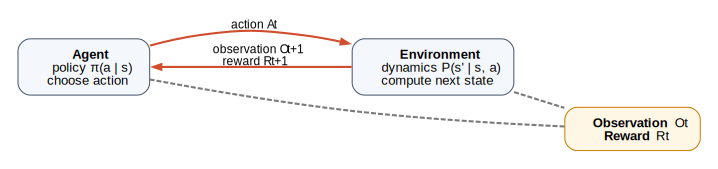

The loop is:

1. the agent receives an observation
2. the agent chooses an action
3. the environment executes that action
4. the environment returns the next observation and a reward

The Atari example from the lecture shows why this interface is hard in practice:

- the rules are not provided directly
- the transition dynamics are not known
- the agent must infer which visual patterns matter and which actions cause which outcomes

Concrete example from the source slides:

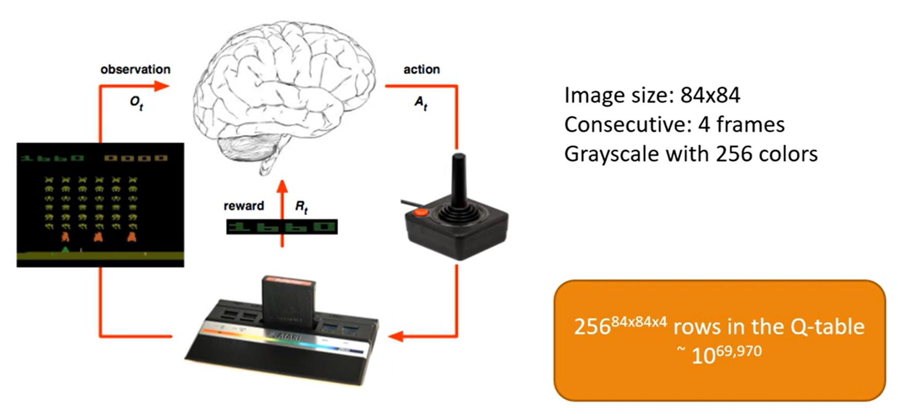

The deck also includes a short video reference:

- Atari video: [https://www.youtube.com/watch?v=V1eYniJ0Rnk](https://www.youtube.com/watch?v=V1eYniJ0Rnk)

The reward slides make one important warning explicit:

- reward tells the agent how well it is doing
- reward does not explain why it is doing well

That is the **credit-assignment problem**: many earlier actions may have contributed to a reward that arrives only now.

By slide 11, the lecture's formal statement is:

- the environment produces observations and rewards
- the agent chooses actions
- the objective is to maximize total reward over time

## 3. State, History, MDPs, and Policies

Slides covered: `12-14`

The lecture asks a design question before it introduces algorithms:

- should the agent use only the current observation?
- the current observation and previous action?
- a short observation window?
- the full history?

The answer depends on the **state** representation.

- **History** `H_t`: everything that has happened so far.
- **State** `S_t`: a summary of that history used for decision making.

The source slides write the history as

$$
H_t = O_1 R_1 A_1 O_2 R_2 A_2 \cdots A_{t-1} O_t R_t.
$$

The state is then a designer-chosen function of that history:

$$
S_t = f(H_t).
$$

Possible state choices from the lecture:

- `O_t`
- `O_t, R_t`
- `A_{t-1}, O_t, R_t`
- a short window of recent observations

This leads to the **Markov property**:

- **Markov property**: the current state contains all information needed for optimal decision making; once the state is known, the rest of the history can be ignored.
- **MDP** or **Markov Decision Process**: a sequential decision problem where the chosen state really is Markov.

> Intuition:
> A good state keeps the information that matters for the future and throws away the rest. If it throws away too much, the problem stops being Markov from the agent's point of view.

The lecture then defines a **policy**:

- **Deterministic policy**: always choose the same action in a given state.
- **Stochastic policy**: choose actions according to a probability distribution.

Formally,

$$
A_t = \pi(S_t)
$$

for a deterministic policy, and

$$
\pi(a \mid s) = P(A_t = a \mid S_t = s)
$$

for a stochastic one.

## 4. Sequential Decision Making and Return

Slides covered: `15-18`

The lecture's central objective is not immediate reward. It is **return**, meaning the cumulative reward from now onward.

The source slide motivates discounting with four reasons:

- short-term rewards matter
- the same reward is usually better now than later
- the future is uncertain
- discounting makes infinite-horizon problems mathematically manageable

The **return** is defined as

$$
G_t = R_{t+1} + \gamma R_{t+2} + \gamma^2 R_{t+3} + \gamma^3 R_{t+4} + \cdots
$$

where `0 \le \gamma \le 1` is the **discount factor**.

You can derive the recursive form by factoring out the first reward:

$$
\begin{aligned}
G_t
&= R_{t+1} + \gamma R_{t+2} + \gamma^2 R_{t+3} + \cdots \\
&= R_{t+1} + \gamma \left(R_{t+2} + \gamma R_{t+3} + \cdots \right) \\
&= R_{t+1} + \gamma G_{t+1}.
\end{aligned}
$$

This is the most important recursion in the lecture: it says future value can be computed recursively from a one-step lookahead.

The best policy is therefore the one that maximizes expected return:

$$
\pi^* = \arg\max_\pi \mathbb{E}_\pi[G_t].
$$

The lecture then compresses the RL algorithm into three stages:

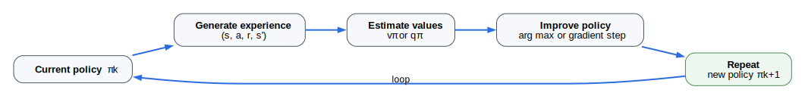

1. generate samples by following a policy
2. estimate return or value from those samples
3. improve the policy using those estimates

Slide 18 notes that agents can also learn from signals other than rewards, such as demonstrations or human preferences, but the rest of this lecture stays within standard reward-based RL.

## 5. Values, Q-Values, Bellman Equations, and Policy Iteration

Slides covered: `19-24`

The lecture next shifts from "which policy is best?" to "how do we estimate how good states and actions are?"

Definitions:

- **Episode**: one complete run of interaction, usually from a start state to termination.
- **Trajectory**: the sequence `S_t, A_t, R_{t+1}, S_{t+1}, ...` observed during an episode.
- **State value** `v_\pi(s)`: expected return starting from state `s` and following policy `\pi`.
- **Action value** `q_\pi(s,a)`: expected return starting from state `s`, taking action `a`, then following policy `\pi`.

The link between them is

$$
v_\pi(s) = \sum_a \pi(a \mid s)\, q_\pi(s,a).
$$

That equation says state values are policy-weighted averages of action values. Going the other direction is harder because you need a transition model.

- **PTM** or **probabilistic transition model**: the distribution `P(s', r \mid s, a)` describing how the environment evolves.

If the PTM is unknown, learning action values directly is often simpler than trying to compute them from state values.

### Bellman expectation and Bellman optimality

The **Bellman equation** is the recursive relationship that links a value to the values of successor states.

For a fixed policy,

$$
v_\pi(s)
= \sum_a \pi(a \mid s) \sum_{s',r} P(s', r \mid s,a)\,[r + \gamma v_\pi(s')].
$$

Likewise,

$$
q_\pi(s,a)
= \sum_{s',r} P(s', r \mid s,a)\left[r + \gamma \sum_{a'} \pi(a' \mid s')\, q_\pi(s',a')\right].
$$

If the goal is optimal control rather than evaluation of a fixed policy, the future policy-weighted average becomes a maximum:

$$
v^*(s)
= \max_a \sum_{s',r} P(s', r \mid s,a)\,[r + \gamma v^*(s')]
$$

and

$$
q^*(s,a)
= \sum_{s',r} P(s', r \mid s,a)\,[r + \gamma \max_{a'} q^*(s',a')].
$$

The short equation shown in the slides,

$$
q(s,a) = r + \gamma \max_{a'} q(s',a'),
$$

is this Bellman-optimality idea with the expectation omitted for readability.

### Policy iteration

Once you have action values, policy improvement is immediate:

$$
\pi'(s) = \arg\max_a q_\pi(s,a).
$$

This leads to **policy iteration**:

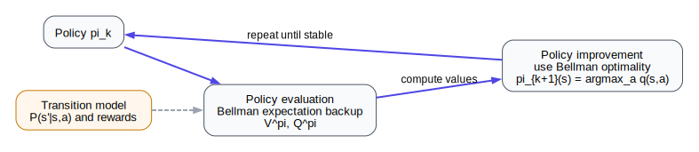

1. evaluate the current policy to estimate `v_\pi` or `q_\pi`
2. improve the policy by acting greedily with respect to those estimates
3. repeat until the policy stops changing

### Tabular Q-learning setup

The lecture ends this block with **tabular** Q-learning:

- **Tabular** means there is one explicit table entry for each discrete state-action pair.

When the state and action spaces are small, the table stores `Q(s,a)` directly. The one-step update rule comes from turning Bellman optimality into an incremental learning rule:

$$
Q(s,a) \leftarrow Q(s,a) + \alpha \delta
$$

where the **TD error** is

$$
\delta = r + \gamma \max_{a'} Q(s',a') - Q(s,a).
$$

This is the first full algorithmic bridge in the lecture: Bellman recursion becomes a practical update from sampled experience.

## 6. Tabular Q-Learning and Epsilon-Greedy Exploration

Slides covered: `25-33`

The next set of slides turns the Bellman idea into the actual control loop used by Q-learning.

The Q-learning cycle is:

1. sample experience
2. update the value estimate
3. improve the policy by being greedier with respect to `Q`

The greedy policy induced by a Q-function is

$$
\pi(s) = \arg\max_a Q(s,a).
$$

But a purely greedy learner stops exploring too early, so the lecture introduces **epsilon-greedy** exploration.

- **Epsilon-greedy**: choose the greedy action with probability `1 - \epsilon`, otherwise choose a random action.

Formally,

$$
a_t =
\begin{cases}
\arg\max_a Q(s_t,a) & \text{with probability } 1-\epsilon \\
\text{random action} & \text{with probability } \epsilon.
\end{cases}
$$

This ensures every action keeps a nonzero chance of being tried.

### One-step lookahead to the tabular update

The one-step lookahead slide is doing a small derivation that is easy to miss.

Start from the Bellman-optimality target

$$
y = r + \gamma \max_{a'} Q(s',a').
$$

Define the temporal-difference error

$$
\delta = y - Q(s,a).
$$

Then update toward the target:

$$
Q(s,a) \leftarrow Q(s,a) + \alpha \delta.
$$

Expanded,

$$
Q(s,a) \leftarrow Q(s,a) + \alpha \left[r + \gamma \max_{a'} Q(s',a') - Q(s,a)\right].
$$

This is still model-free:

- **Model-free** means the algorithm learns from sampled transitions without an explicit PTM.
- **Bootstrapping** means an update target is built partly from the current value estimate itself, as in `r + \gamma \max_{a'} Q(s',a')`.

> Intuition:
> Q-learning does not need to know how the world works in advance. It only needs experience tuples `(s, a, r, s')` and a way to revise its estimates.

## 7. Why Tabular Methods Break, Then Function Approximation

Slides covered: `34-38`

The lecture next asks what happens when the table becomes too large.

Tabular methods break for two reasons:

- storage cost grows with the full state-action space
- there is no generalization to unseen states

That leads to **function approximation**:

- **Function approximation** means replacing the table with a parameterized model that predicts values from features.

Instead of one entry per state, learn a function

$$
\hat v(s; w) \approx v_\pi(s)
$$

or

$$
\hat q(s,a; w) \approx q_\pi(s,a),
$$

where `w` are the model parameters.

Why this helps:

- similar states can share parameters
- the agent can generalize from visited states to unvisited ones
- continuous or very large state spaces become manageable

The training problem becomes regression on a target value:

$$
\min_w \left(\hat y - \hat q(s,a; w)\right)^2.
$$

The algorithmic idea stays the same. Only the representation of the value function changes.

## 8. Deep Q-Learning: Network, Replay, and Target Stabilization

Slides covered: `39-45`

Atari is the motivating example because the observation is raw pixels rather than a small symbolic state.

Concrete source illustration:

A **deep Q-network** or **DQN** uses a neural network `Q(s,a; w)` that takes the observation as input and outputs one value per action.

The high-level workflow is:

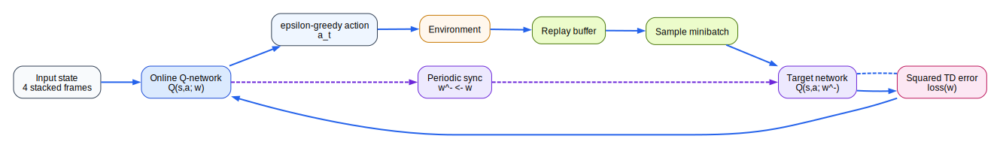

### DQN loss

The one-step target becomes

$$
y = r + \gamma \max_{a'} Q(s',a'; w^-),
$$

where `w^-` is the **target network** parameter set.

- **Target network**: a delayed copy of the online network used only for target computation.

The loss on one transition is the squared TD error:

$$
L(w) = \left(y - Q(s,a; w)\right)^2.
$$

This is exactly the tabular Q-learning idea, but with a neural network in place of the lookup table.

### Experience replay

- **Experience replay**: store transitions in a replay buffer and train on randomly sampled minibatches from that buffer.

Replay helps because it

- breaks the strong temporal correlation between consecutive samples
- reuses old experience more efficiently

### Why the target network helps

Without a target network, the network would be changing the value estimate and the target at the same time. That creates unstable feedback because the learner is chasing a moving target that it is also producing.

Using `w^-` slows the movement of the target and stabilizes optimization.

> Pitfall:
> Bootstrapping is powerful because it learns from partial trajectories, but it is also dangerous because errors can feed back into future targets. Replay and target networks are the lecture's main fixes for that instability.

## 9. Policy Gradients and REINFORCE

Slides covered: `46-49`

Value-based methods learn `Q` and then derive a policy by maximization. **Policy-gradient** methods learn the policy directly.

- **Policy gradient**: optimize the parameters of `\pi_\theta(a \mid s)` by maximizing expected return.

The objective is

$$
J(\theta) = \mathbb{E}_{\pi_\theta}[G_t].
$$

### Log-derivative trick

Let `\tau` be a trajectory and `R(\tau)` its return. Then

$$
J(\theta) = \sum_\tau p_\theta(\tau) R(\tau).
$$

Differentiate:

$$
\nabla_\theta J(\theta)
= \sum_\tau \nabla_\theta p_\theta(\tau)\, R(\tau).
$$

Use the identity

$$
\nabla_\theta p_\theta(\tau)
= p_\theta(\tau)\, \nabla_\theta \log p_\theta(\tau)
$$

to obtain

$$
\nabla_\theta J(\theta)
= \sum_\tau p_\theta(\tau)\, \nabla_\theta \log p_\theta(\tau)\, R(\tau)
= \mathbb{E}_{\pi_\theta}\!\left[\nabla_\theta \log p_\theta(\tau)\, R(\tau)\right].
$$

Because only the policy terms depend on `\theta`, the gradient becomes

$$
\nabla_\theta J(\theta)
= \mathbb{E}_{\pi_\theta}\!\left[\sum_t \nabla_\theta \log \pi_\theta(a_t \mid s_t)\, G_t\right].
$$

This is the **REINFORCE** estimator:

- **REINFORCE**: a Monte Carlo policy-gradient method that uses sampled episode returns.

Interpretation:

- actions followed by large return have their probability increased
- actions followed by poor return have their probability decreased

The lecture also points to an external derivation:

- REINFORCE reference: [https://medium.com/@thechrisyoon/deriving-policy-gradients-and-implementing-reinforce-f887949bd63](https://medium.com/@thechrisyoon/deriving-policy-gradients-and-implementing-reinforce-f887949bd63)

## 10. Actor-Critic

Slides covered: `50-52`

REINFORCE is correct but high variance. The lecture's fix is **actor-critic**.

- **Actor**: the policy model `\pi_\theta(a \mid s)`.
- **Critic**: a value estimator that evaluates states or actions and supplies a lower-variance learning signal.

Workflow:

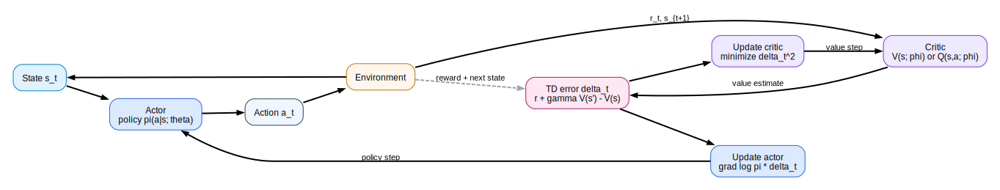

If the critic estimates a state value `V_w(s)`, then the critic's one-step TD error is

$$
\delta_t = R_{t+1} + \gamma V_w(S_{t+1}) - V_w(S_t).
$$

The actor update is

$$
\theta \leftarrow \theta + \alpha \nabla_\theta \log \pi_\theta(A_t \mid S_t)\, \delta_t,
$$

and the critic update is

$$
w \leftarrow w + \beta \delta_t \nabla_w V_w(S_t).
$$

Why this reduces variance:

- REINFORCE waits for the whole return `G_t`
- actor-critic replaces that noisy return with a learned local estimate of whether the action was better or worse than expected

The lecture also links to a reference overview:

- Actor-critic reference: [https://lilianweng.github.io/posts/2018-04-08-policy-gradient/](https://lilianweng.github.io/posts/2018-04-08-policy-gradient/)

## 11. Reward Design, Reward Hacking, and Gridworld Evaluation

Slides covered: `53-60`

The lecture briefly returns to real-world examples before turning to reward design.

Concrete examples from the source deck:

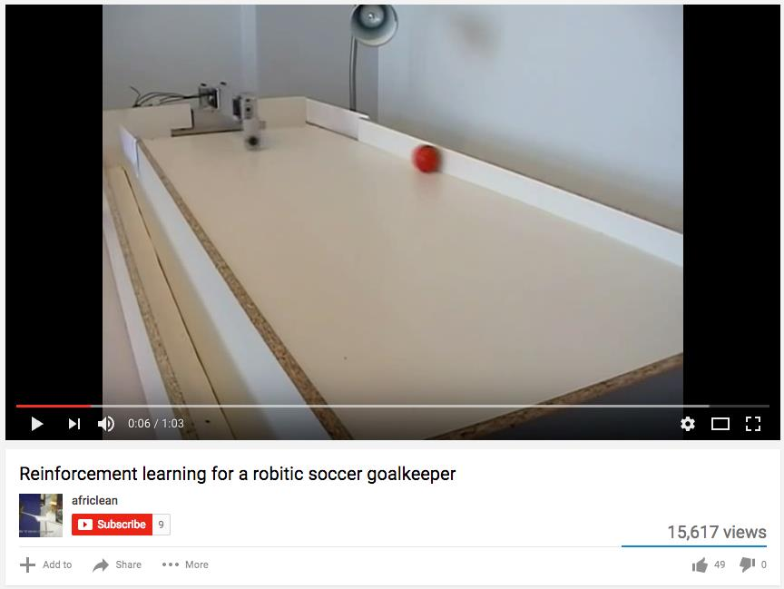

- Robotic soccer video: [https://www.youtube.com/watch?v=CIF2SBVY-J0](https://www.youtube.com/watch?v=CIF2SBVY-J0)

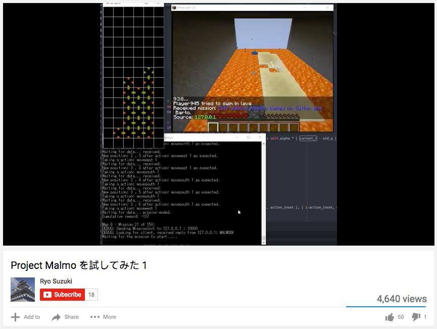

- Malmo video: [https://www.youtube.com/watch?v=9XRL6d-yxp4](https://www.youtube.com/watch?v=9XRL6d-yxp4)

These examples are included to remind you that RL is not only about toy gridworlds. In both cases, immediate feedback is sparse and long-term consequences matter more than single actions.

### Reward versus Q-value

Slides `55-58` make a critical distinction:

- **Reward** is immediate.
- **Q-value** is long-term.

Formally, `Q(s,a)` is the expected return after taking action `a` in state `s`. That is why an action can have pleasant immediate reward but poor Q-value, or unpleasant immediate reward but high Q-value.

The lecture's "party versus study" example is exactly this:

- partying may feel good immediately
- studying may feel bad immediately
- but studying can have the higher long-term return

This also explains a design constraint:

- you choose the reward function
- you do not directly choose the Q-values
- the reward function and the environment dynamics together induce the Q-values

### Reward shaping and reward hacking

The lecture warns against using reward only as "guidance."

Suppose you give positive reward whenever the agent gets closer to the goal. That can create a bad loophole:

- the agent can orbit near the goal
- it keeps collecting shaping reward
- it never actually finishes the task

That is **reward hacking**: the agent exploits the literal reward definition without solving the intended task.

In navigation tasks, a small negative step cost such as `-1` per move often works better because it gives the agent a reason to terminate quickly.

### Gridworld reward thresholds

Slide `59` shows that optimal policies in the classic stochastic 4x3 gridworld change when the per-step reward `r` changes.

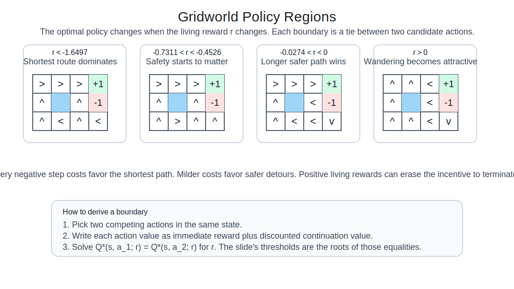

The key idea is that each boundary is a tie between two candidate actions in the same state:

$$
Q^*(s,a_1; r) = Q^*(s,a_2; r).
$$

For a candidate route of length `T` that eventually reaches a terminal reward `R_{\text{terminal}}`, the expected return has the form

$$
G(r) = \sum_{t=0}^{T-1} \gamma^t r + \gamma^T R_{\text{terminal}},
$$

with additional stochastic terms when slippage can send the agent toward the `-1` square. The thresholds on the slide arise by solving equalities of that form between competing routes:

- `r < -1.6497`
- `-0.7311 < r < -0.4526`
- `-0.0274 < r < 0`
- `r > 0`

You do not need to memorize the constants. The real lesson is that changing the living reward changes the balance between speed, safety, and even the incentive to terminate.

### Evaluating a random policy

Slide `60` switches from control to evaluation:

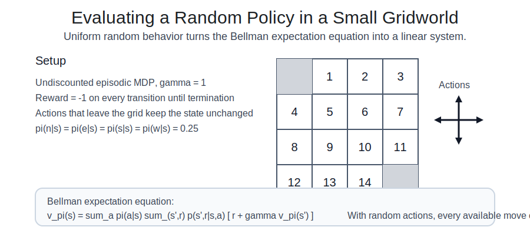

This is an **undiscounted episodic MDP** with `\gamma = 1`, reward `-1` per step, and a uniform random policy:

$$
\pi(n \mid s) = \pi(e \mid s) = \pi(s \mid s) = \pi(w \mid s) = 0.25.
$$

The Bellman expectation equation becomes a linear system over the 14 nonterminal states:

$$
v_\pi(s)
= \sum_a \pi(a \mid s)\sum_{s',r} P(s',r \mid s,a)\,[r + v_\pi(s')].
$$

Because every move costs `-1`, states farther from termination have more negative value.

## 12. On-Policy vs Off-Policy, SARSA vs Q-Learning

Slides covered: `61-64`

The lecture next separates the policy used to collect data from the policy being optimized.

- **Sampling policy** or **behavior policy**: the policy used to choose actions during learning.
- **Target policy**: the policy whose value the algorithm is trying to estimate or optimize.

This leads to two major categories:

- **On-policy** learning: sampling policy and target policy are the same.
- **Off-policy** learning: sampling policy and target policy are different.

The lecture's comparison figure:

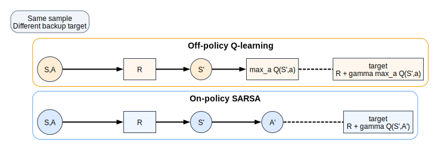

### SARSA and Q-learning side by side

**SARSA** is on-policy. Its update uses the action that was actually chosen next:

$$
Q(S,A) \leftarrow Q(S,A) + \alpha \bigl(R + \gamma Q(S',A') - Q(S,A)\bigr).
$$

**Q-learning** is off-policy. Its update uses the greedy action value, whether or not that action was actually taken:

$$
Q(S,A) \leftarrow Q(S,A) + \alpha \bigl(R + \gamma \max_{a'} Q(S',a') - Q(S,A)\bigr).
$$

This distinction matters in the cliff-walking style example from slide `63`:

- SARSA learns the value of behaving with exploration included, so it often learns a safer path
- Q-learning learns the greedy target policy, so it often learns the more aggressive optimal path

Slide `64` also notes that exploration policies can include heuristic guidance. A clean abstract version is

$$
a_t = \arg\max_a \left(Q(s_t,a) + \lambda h(a)\right),
$$

where `h(a)` is a hand-designed guidance term and `\lambda` controls how strongly it is used.

The conceptual separation remains the same:

- behavior policy gathers data
- target policy defines the objective

## 13. State Representation in Gridworld and Lava World

Slides covered: `65-72`

The last part of the lecture is about representation, not update rules.

- **Observation** is what the agent literally sees.
- **State** is the representation the agent chooses for decision making.

The right representation trades off:

- expressiveness
- generalization
- learnability

The lecture's main representation spectrum is:

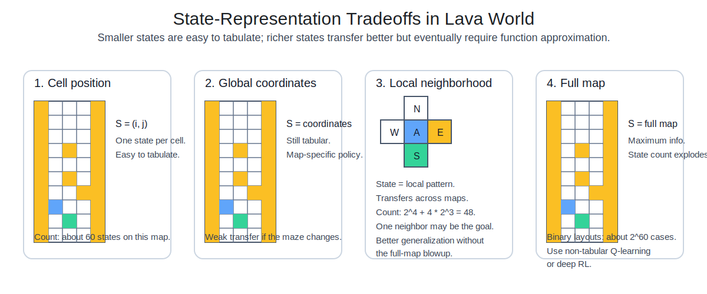

### Cell position

If the state is just the current grid cell, the state space is small and tabular Q-learning is feasible. But the policy becomes tied to the exact map. Learning does not transfer well.

### Global coordinates

Global coordinates say "I am in this exact place on this exact map." That still does not generalize when the same local geometry appears somewhere else.

### Local neighborhood

A neighborhood representation encodes the pattern immediately around the agent, such as the contents of the north, east, south, and west cells.

This lets the agent learn reusable local rules such as:

- avoid lava beside you
- move toward a visible goal
- prefer open corridors over blocked ones

The slide gives the state-count formula

$$
2^4 + 4 \times 2^3.
$$

One clean interpretation is:

- `2^4` cases when the four neighbors are just binary terrain types
- `4 \times 2^3` additional cases when one neighbor is the goal and the other three remain binary

So the total is

$$
16 + 32 = 48.
$$

That is still small enough to tabulate, but it generalizes much better than exact coordinates.

### Why not the full map?

The full map contains the most information, but the number of possible layouts explodes.

If a map contains about 60 binary cells, then the number of possible layouts is on the order of

$$
2^{60}.
$$

That is the combinatorial blow-up behind slide `72`. It explains why a tabular method is hopeless on full-map input:

- there are too many states
- the agent cannot visit enough of them
- the value table cannot generalize between related layouts

That is why the lecture concludes with **non-tabular Q-learning** and, in modern settings, deep RL.

- **Non-tabular** means value estimates are represented by a function approximator rather than a lookup table.

## Glossary

- **Action**: a choice made by the agent.
- **Actor**: the policy network in actor-critic methods.
- **Agent**: the learner or decision maker.
- **Bellman equation**: a recursive equation relating a value to the values of successor states.
- **Bootstrapping**: using a current estimate inside the target used to update that same estimate.
- **Critic**: the value estimator in actor-critic methods.
- **Environment**: the external system the agent interacts with.
- **Episode**: one complete interaction sequence from start to termination.
- **Epsilon-greedy**: exploration rule that is greedy with probability `1-\epsilon` and random with probability `\epsilon`.
- **Experience replay**: training on minibatches sampled from a stored transition buffer.
- **Function approximation**: representing a value function with a parameterized model instead of a table.
- **History**: the full sequence of observations, rewards, and actions seen so far.
- **Markov property**: the present state is sufficient for predicting the future relevant to control.
- **MDP**: Markov Decision Process.
- **Model-free**: learning from sampled experience without an explicit transition model.
- **Observation**: the raw input the agent receives from the environment.
- **Off-policy**: learning about one policy while collecting data with another.
- **On-policy**: learning about the same policy that generates the data.
- **Policy**: a rule that maps states to actions or action probabilities.
- **Policy gradient**: a direct gradient-based method for optimizing policy parameters.
- **PTM**: probabilistic transition model `P(s',r \mid s,a)`.
- **Q-value**: expected return from taking action `a` in state `s`.
- **REINFORCE**: Monte Carlo policy-gradient algorithm using sampled returns.
- **Reward**: immediate scalar feedback from the environment.
- **Reward hacking**: exploiting the literal reward signal without solving the intended task.
- **Return**: discounted sum of future rewards.
- **SARSA**: on-policy TD control method using `S, A, R, S', A'`.
- **State**: internal representation used for decision making.
- **Tabular**: storing one value for each discrete state or state-action pair.
- **Target network**: a delayed copy of the online Q-network used to stabilize targets.
- **TD error**: difference between a target and the current estimate.
- **Trajectory**: observed sequence of states, actions, and rewards.
- **Value**: expected return under a policy, typically `v_\pi(s)` or `q_\pi(s,a)`.

## Slide Coverage Map

Every source slide is represented in the reconstructed notes.

- `1-3`: motivation and how RL differs from supervised learning
- `4-7`: agent-environment interface and Atari framing
- `8-11`: reward semantics, delayed consequences, and the formal RL objective
- `12-14`: state design, history, MDPs, and policies
- `15-18`: return, discounting, best policy, and the RL algorithm loop
- `19-24`: episodes, value functions, Bellman equations, policy iteration, and tabular Q-learning
- `25-33`: Q-learning mechanics, epsilon-greedy exploration, and one-step lookahead
- `34-38`: large-scale RL and function approximation
- `39-45`: DQN architecture, replay, and stabilization
- `46-49`: policy gradients and REINFORCE
- `50-52`: actor-critic
- `53-54`: robotic soccer and Malmo examples
- `55-58`: reward design, guidance, and reward hacking
- `59-60`: reward thresholds in gridworld and random-policy evaluation
- `61-64`: sampling policy, target policy, on-policy/off-policy learning, and SARSA vs Q-learning
- `65-72`: state representation, lava-world abstractions, and the move from tabular to non-tabular methods

## References

- Source lecture PDF: [lecture-02-intro-to-rl.pdf](../../lecture-02-intro-to-rl.pdf)
- Atari example video: [https://www.youtube.com/watch?v=V1eYniJ0Rnk](https://www.youtube.com/watch?v=V1eYniJ0Rnk)
- Robotic soccer video: [https://www.youtube.com/watch?v=CIF2SBVY-J0](https://www.youtube.com/watch?v=CIF2SBVY-J0)
- Malmo video: [https://www.youtube.com/watch?v=9XRL6d-yxp4](https://www.youtube.com/watch?v=9XRL6d-yxp4)
- REINFORCE derivation reference: [https://medium.com/@thechrisyoon/deriving-policy-gradients-and-implementing-reinforce-f887949bd63](https://medium.com/@thechrisyoon/deriving-policy-gradients-and-implementing-reinforce-f887949bd63)
- Actor-critic overview: [https://lilianweng.github.io/posts/2018-04-08-policy-gradient/](https://lilianweng.github.io/posts/2018-04-08-policy-gradient/)
